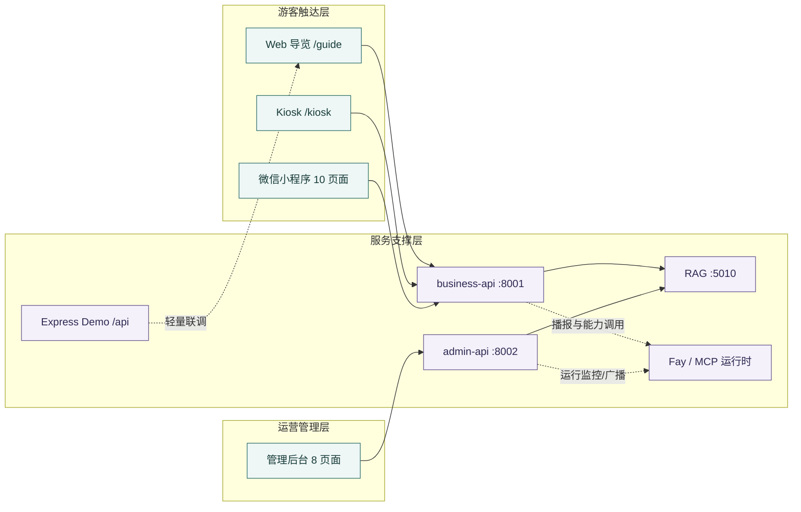

# 灵山胜境智慧景区 AI 数字人导览平台 — 需求分析说明书

> **文档版本**：v1.1（实现复核版）  
> **初版日期**：2026年6月30日  
> **实现复核日期**：2026年7月14日  
> **实现基线**：`main@c3ae3b6`（以当前工作区代码为准）  
> **文档定位**：软件杯 A5 赛题「景区导览服务 AI 数字人」需求分析与实现边界说明  
> **适用标准**：GB/T 8567-2006《计算机软件文档编制规范》  
> **对应项目**：Software-Digital-human（灵山胜境智慧景区数字人平台）

*图 1　游客、数字人、景区知识与运营后台构成的服务生态。插图用于表达业务关系，精确实现边界以本文表格与代码锚点为准。*

> [!IMPORTANT]
> 本版文档将能力分为 **已实现、部分实现、规划/预留** 三种状态。主业务链路为 Web/小程序 → FastAPI business-api/admin-api → RAG/Fay；`backend/src` 下的 Express 服务为轻量演示与联调实现，不与主业务 API 混为同一生产链路。

---

## 0. 执行摘要与实现边界

当前系统不是单一“聊天页面”，而是由游客触达、运营管理和智能服务三层共同组成：

| 能力层 | 当前实现 | 说明 |
|---|---|---|
| 游客触达层 | Web 导览页、Kiosk 展示页、原生微信小程序 10 个页面 | 覆盖问答、景点、路线、拍照入口、活动、票务、服务、应急与反馈 |
| 运营管理层 | 8 个后台路由页面 | 数据大屏、知识库、内容审核、数字人配置、系统设置、指挥中心、数字人监控、工单中心 |
| 业务服务层 | business-api（61 个路由）、admin-api（62 个路由） | 分离游客公开业务与管理域能力 |
| 智能服务层 | RAG 服务（7 个路由）、Fay 数字人运行时、MCP 工具桥 | 提供检索、引用、降级、播报与扩展能力 |
| 演示兼容层 | Express Demo API | 用于轻量联调与静态演示，不作为 Web 主链路默认后端 |

*图 2　需求域与当前实现的对应关系。实线表示主业务调用，虚线表示运行时或演示链路。*

### 状态口径

- **已实现**：仓库存在可定位的页面、接口或运行模块。
- **部分实现**：服务端、Web、小程序或数字人运行时之间仅部分终端完成闭环。
- **规划/预留**：文档保留目标，但当前代码尚未形成可验证闭环。

---
## 目录

1. [项目背景与目标](#一项目背景与目标)
2. [用户角色分析](#二用户角色分析)
3. [功能性需求](#三功能性需求)
4. [非功能性需求](#四非功能性需求)
5. [约束条件](#五约束条件)

---

## 一、项目背景与目标

### 1.1 项目背景

随着人工智能技术的快速发展，智慧旅游已成为文旅行业转型升级的重要方向。灵山胜境（位于江苏省无锡市，国家5A级旅游景区，世界佛教论坛永久会址）年接待游客数百万人次，景区规模大、景点分布广、文化内涵深厚，传统的人工导游服务面临以下痛点：

1. **人力资源受限**：导游数量有限，高峰期供不应求，游客等待时间长；
2. **服务覆盖不均**：热门景点讲解资源集中，冷门区域缺乏讲解覆盖；
3. **个性化不足**：固定导游词无法根据游客兴趣偏好动态调整；
4. **管理效率低**：运营数据采集滞后，应急响应缺乏智能化手段；
5. **多模态交互缺失**：传统语音导览无法提供视觉辅助、实时问答等交互体验。

第十五届"中国软件杯"大学生软件设计大赛A5赛题「景区导览服务AI数字人」正是针对上述行业痛点，要求参赛团队设计并实现一套基于AI数字人的智能景区导览系统。

### 1.2 项目目标

本项目致力于构建一个集**数字人交互、RAG知识检索、智能路线规划、运营管理后台**于一体的智慧景区导览平台，实现以下核心目标：

1. **提供多模态景区导览体验**：通过AI数字人形象，结合语音合成（TTS）、语音识别（ASR）、Live2D口型同步等技术，实现"看得见、听得清、能对话"的沉浸式导览；
2. **构建景区知识中枢**：基于RAG（检索增强生成）技术，对灵山胜境官方资料进行深度加工，实现高准确率的景点知识问答；
3. **智能化游览辅助**：基于游客画像和实时状态，提供个性化路线推荐、到达讲解、排队管理等智能服务；
4. **建设运营管理闭环**：为景区运营人员提供知识库管理、数字人配置、数据大屏、工单处置等一体化管理工具；
5. **覆盖多端触达**：支持Web端导游页面、管理后台及微信小程序等多端访问。

### 1.3 预期应用场景

| 场景 | 描述 | 用户群体 |
|------|------|----------|
| 游客现场导览 | 游客在景区内扫码或打开Web端，与AI数字人对话获取景点讲解、路线指引 | 普通游客 |
| 智能问答 | 游客通过文字/语音输入提问，系统基于RAG知识库返回精准答案 | 普通游客 |
| 路线规划 | 根据游客偏好（亲子/文化/自然等）推荐游览路线并展示沿途景点 | 普通游客 |
| 运营指挥 | 景区管理人员通过大屏监控客流、处理工单、调度资源 | 运营人员 |
| 知识库管理 | 知识库管理员上传文档、管理问答对、审核低置信度回答 | 知识管理员 |
| 数字人配置 | 管理员切换数字人形象、音色、调整播报参数 | 管理员 |

---

## 二、用户角色分析

### 2.1 用户角色定义

| 角色编号 | 角色名称 | 角色描述 | 使用终端 |
|----------|----------|----------|----------|
| R-01 | 普通游客 | 前往灵山胜境景区游览的游客，使用导游功能获取导览服务 | Web导游页 / 小程序 |
| R-02 | 运营管理员 | 景区运营管理人员，负责数据监控、工单处理、应急调度 | 管理后台 |
| R-03 | 知识库管理员 | 负责知识库文档管理、问答对审核、检索效果监控 | 管理后台（知识库模块） |
| R-04 | 系统管理员 | 负责数字人形象/音色配置、系统参数设置、运行状态监控 | 管理后台（系统设置/数字人配置） |
| R-05 | 游客服务人员 | 处理游客投诉、工单、反馈等前台业务 | 管理后台（工单中心） |

### 2.2 各角色权限矩阵

| 功能模块 | 普通游客 | 运营管理员 | 知识库管理员 | 系统管理员 | 客服人员 |
|----------|:--------:|:----------:|:------------:|:----------:|:--------:|
| 景点浏览与查询 | ✅ | ✅ | — | — | — |
| AI数字人对话 | ✅ | — | — | — | — |
| 路线规划（C端） | ✅ | — | — | — | — |
| 数据大屏（运营） | — | ✅ | — | — | — |
| 知识库管理 | — | — | ✅ | — | — |
| 数字人形象配置 | — | — | — | ✅ | — |
| 工单处理 | — | ✅ | — | — | ✅ |
| 系统参数配置 | — | — | — | ✅ | — |
| 内容审核 | — | — | ✅ | — | — |
| 用户反馈管理 | — | ✅ | — | — | ✅ |

---

## 三、功能性需求

### 3.1 功能模块总览

系统按 **游客端、运营端、服务端** 三类能力域组织。原有需求编号保持不变，同时补充当前代码中已经落地、但 v1.0 文档未列出的扩展模块。

| 模块编号 | 模块名称 | 所属子系统 | 当前状态 | 主要用户角色 |
|---|---|---|:---:|---|
| M-C-01 | 数字人导览交互 | Web / 小程序 / 数字人运行时 | 部分实现 | 普通游客 |
| M-C-02 | 景点详情展示 | Web / 小程序 | 已实现 | 普通游客 |
| M-C-03 | 路线规划与推荐 | Web / 小程序 | 已实现 | 普通游客 |
| M-C-04 | 拍照识景入口 | Web / 小程序 | 部分实现 | 普通游客 |
| M-C-05 | 语音交互入口 | Web / 数字人运行时 | 部分实现 | 普通游客 |
| M-C-06 | Kiosk 展示模式 | Web `/kiosk` | 已实现 | 现场游客 |
| M-C-07 | 票务、活动、服务、应急与反馈 | 微信小程序 | 已实现 | 普通游客 |
| M-B-01 | 运营数据大屏 | 管理后台 | 已实现 | 运营管理员 |
| M-B-02 | 知识库管理 | 管理后台 | 已实现 | 知识库管理员 |
| M-B-03 | 内容审核展示 | 管理后台 | 部分实现 | 知识库管理员 |
| M-B-04 | 数字人选择与预览 | 管理后台 | 部分实现 | 系统管理员 |
| M-B-05 | 工单与应急管理 | 管理后台 | 已实现 | 运营管理员/客服 |
| M-B-06 | 系统设置 | 管理后台 | 已实现 | 系统管理员 |
| M-B-07 | 运营指挥中心 | 管理后台 | 已实现 | 运营管理员 |
| M-B-08 | 数字人运行监控 | 管理后台 | 已实现 | 系统管理员 |
| M-S-01 | RAG 知识检索 | RAG 服务 | 已实现 | 内部调用 |
| M-S-02 | 会话与消息管理 | business-api | 已实现 | 内部调用 |
| M-S-03 | 运营数据采集与分析 | business/admin API | 已实现 | 内部调用 |
| M-S-04 | 数字人运行时与 MCP 扩展 | Fay / MCP | 部分实现 | 内部调用 |

### 3.2 C端 — 数字人导览交互（M-C-01）

#### 3.2.1 数字人形象展示

| 字段 | 内容 |
|---|---|
| **功能编号** | F-C-01-01 |
| **功能名称** | 数字人形象展示与播报状态反馈 |
| **当前状态** | **部分实现**：Web 端已具备轻量数字人视觉组件、说话状态动画与景区标签；Fay/Live2D 资源和运行时独立存在 |
| **触发条件** | 游客进入导游主页（`/guide`）时加载 Web 数字人组件 |
| **输入** | 播报状态、景区/景点名称 |
| **输出** | 说话/空闲状态、基础嘴部动画、播报状态提示 |
| **实现边界** | Web 主导览页尚未形成“多套 Live2D 形象切换 + 场景背景联动 + Fay 实时驱动”的完整闭环；相关能力在运行时与后台监控模块中预留或独立实现 |

#### 3.2.2 智能问答

| 字段 | 内容 |
|------|------|
| **功能编号** | F-C-01-02 |
| **功能名称** | 景点知识智能问答 |
| **触发条件** | 游客在聊天面板输入问题或语音输入 |
| **输入** | 游客提问文本（如"灵山大佛有多高？"） |
| **输出** | ① 文本回答；② 引用来源（知识片段）；③ 置信度标识（高/中/低）；④ 语音播报（TTS） |
| **业务规则** | ① 通过RAG代理接口查询（business-api → RAG服务）；② 检索置信度≥0.5时返回回答，否则返回兜底话术；③ 支持13类常见问答兜底数据；④ 检索耗时≤5秒；⑤ 记录每次问答用于效果评估 |
| **前置条件** | 网络连接正常，RAG服务（:5010）可达 |

#### 3.2.3 到达讲解

| 字段 | 内容 |
|---|---|
| **功能编号** | F-C-01-03 |
| **功能名称** | 景点到达事件与讲解触发 |
| **当前状态** | **多端实现程度不同**：服务端已提供到达事件、位置上报与讲解词查询；小程序具备会话/消息接口；Web 端以手动问答和详情浏览为主 |
| **输入** | 景点 ID、触发方式（manual / scan / gps）、可选位置信息 |
| **输出** | 到达事件记录、适配篇幅的讲解内容、可选播报任务 |
| **业务规则** | 讲解词按 short → brief → long → fallback 选择；自动扫码/LBS 触发闭环应按终端分别验收，不统一宣称全部端已完成 |

### 3.3 C端### 3.3 C端 — 景点详情展示（M-C-02）

#### 3.3.1 景点列表与详情

| 字段 | 内容 |
|------|------|
| **功能编号** | F-C-02-01 |
| **功能名称** | 景点信息浏览 |
| **触发条件** | 游客在导游页点击"景点"标签，或直接访问景点详情页 |
| **输入** | 景点ID（可选，不传则展示列表） |
| **输出** | 景点列表（名称、标签、简介）或景点详情（完整介绍、高清图片、标签、位置） |
| **业务规则** | ① 数据来源于business-api /v1/spots；② 景点按热门程度排序；③ 详情页包含位置定位、开放时间、游览提示 |

### 3.4 C端 — 路线规划与推荐（M-C-03）

| 字段 | 内容 |
|------|------|
| **功能编号** | F-C-03-01 |
| **功能名称** | 游览路线推荐 |
| **触发条件** | 游客点击"路线推荐"标签 |
| **输入** | 过滤条件（可选：文化/亲子/自然/全景） |
| **输出** | 路线列表（名称、类型、时长、适合人群、途经景点） |
| **业务规则** | ① 数据来源于business-api /v1/routes；② 每条路线包含完整停靠点及停留时长建议；③ 路线详情展示游览小贴士 |

### 3.5 C端 — 拍照识景（M-C-04）

| 字段 | 内容 |
|------|------|
| **功能编号** | F-C-04-01 |
| **功能名称** | 拍照识景 |
| **触发条件** | 游客点击"拍照识景"按钮 |
| **输入** | 摄像头捕获的图片 / 从相册上传的图片 |
| **输出** | 识别结果（景点名称、简介）或空态提示 |
| **业务规则** | ① 当前使用前端模拟占位；② 预留对接第三方图像识别服务的扩展接口 |

### 3.6 C端 — 语音交互（M-C-05）

| 字段 | 内容 |
|------|------|
| **功能编号** | F-C-05-01 |
| **功能名称** | 语音输入与识别 |
| **触发条件** | 游客点击语音按钮开始录音 |
| **输入** | 游客语音（麦克风采集） |
| **输出** | 识别后的文本 → 自动填充到问答输入框 |
| **业务规则** | ① 使用浏览器Web Speech API或阿里云ASR接口；② 支持中英文识别；③ 录音时长上限60秒 |

### 3.7 B端 — 运营数据大屏（M-B-01）

| 字段 | 内容 |
|------|------|
| **功能编号** | F-B-01-01 |
| **功能名称** | 指挥中心大屏 |
| **触发条件** | 运营管理员登录后默认进入 |
| **输入** | 无 |
| **输出** | ① 实时在园人数及趋势图；② 景点热力分布；③ 客流时段分析；④ 天气信息；⑤ 告警列表；⑥ 营收概览；⑦ 满意度评分；⑧ 设施负载状态 |
| **业务规则** | ① 数据每30秒自动刷新；② 数据来源为business-api `/v1/analytics` 系列接口；③ 告警级别分为warn/info，推送至告警列表 |

### 3.8 B端 — 知识库管理（M-B-02）

#### 3.8.1 知识库状态概览

| 字段 | 内容 |
|------|------|
| **功能编号** | F-B-02-01 |
| **功能名称** | 知识库状态查看 |
| **触发条件** | 知识库管理员进入"知识库"页面 |
| **输入** | 无 |
| **输出** | ① 知识库向量总数；② Embedding模型及提供商；③ 分块配置（chunk_size / overlap）；④ 评分阈值；⑤ 已登记资料数与问答对数 |

#### 3.8.2 文档入库

| 字段 | 内容 |
|------|------|
| **功能编号** | F-B-02-02 |
| **功能名称** | 知识文档上传与入库 |
| **触发条件** | 管理员点击"上传文档"并选择文件 |
| **输入** | 文件（.md / .docx / .txt）、资料名称、领域分类 |
| **输出** | 入库结果（job_id、成功/失败、chunk数、耗时） |
| **业务规则** | ① 文件经管线处理：解析→清洗→分块→Embedding→入库；② 支持增量追加；③ 入库完成后自动更新向量索引 |

#### 3.8.3 资料源管理

| 字段 | 内容 |
|------|------|
| **功能编号** | F-B-02-03 |
| **功能名称** | 资料源登记与查询 |
| **触发条件** | 管理员登记新资料源或查看已有资料列表 |
| **输入** | 名称、来源路径、领域分类、描述、标签 |
| **输出** | 分页的资料源列表 |
| **业务规则** | ① 分页显示（默认每页20条）；② 支持按领域筛选 |

#### 3.8.4 问答对管理

| 字段 | 内容 |
|------|------|
| **功能编号** | F-B-02-04 |
| **功能名称** | 问答对录入与查询 |
| **触发条件** | 管理员手动录入标准问答对 |
| **输入** | 问题、答案、来源、领域 |
| **输出** | 分页的问答对列表 |
| **业务规则** | ① 录入的问答对可用于RAG检索增强；② 支持分页查询 |

#### 3.8.5 知识库检索测试

| 字段 | 内容 |
|------|------|
| **功能编号** | F-B-02-05 |
| **功能名称** | 检索效果测试 |
| **触发条件** | 管理员在知识库页面中输入测试查询 |
| **输入** | 查询文本、top_k参数 |
| **输出** | ① 检索结果列表（文本片段+相关性分数）；② 引用来源；③ 是否触发兜底；④ 检索耗时 |
| **业务规则** | ① 支持"仅检索"和"检索+LLM生成"两种模式；② 检索结果展示原始score |

#### 3.8.6 索引重建

| 字段 | 内容 |
|------|------|
| **功能编号** | F-B-02-06 |
| **功能名称** | 知识库索引重建 |
| **触发条件** | 管理员点击"重建索引" |
| **输入** | 景区ID、重建原因 |
| **输出** | 重建结果（状态、消息） |
| **业务规则** | ① 清空当前向量库；② 需重新执行文档入库操作 |

### 3.9 B端 — 内容审核（M-B-03）

| 字段 | 内容 |
|------|------|
| **功能编号** | F-B-03-01 |
| **功能名称** | 低置信度查询审核 |
| **触发条件** | 管理员进入"内容审核"页面 |
| **输入** | 分页参数 |
| **输出** | ① 低置信度问答列表（用户问题、系统回复、置信度分数、兜底原因）；② 支持审核操作（批准/驳回） |
| **业务规则** | ① 展示置信度低于阈值（默认0.5）的查询记录；② 审核通过的回答可录入为标准问答对 |

### 3.10 B端 — 数字人配置（M-B-04）

| 字段 | 内容 |
|---|---|
| **功能编号** | F-B-04-01 |
| **功能名称** | 数字人形象选择与预览 |
| **当前状态** | **部分实现**：已完成形象列表拉取、选择状态与预览界面 |
| **输入** | 选中的数字人形象 ID |
| **输出** | 形象名称、风格、预览与本地选择状态 |
| **实现边界** | “保存并立即激活到 Fay 运行时”需以后端激活接口和运行时回执为验收依据，当前页面不应直接表述为切换立即生效 |

| 字段 | 内容 |
|---|---|
| **功能编号** | F-B-04-02 |
| **功能名称** | 数字人音色选择与预览 |
| **当前状态** | **部分实现**：已完成音色列表、选择与展示 |
| **输入** | 选中的音色 ID |
| **输出** | 音色名称、说明与界面选择状态 |
| **实现边界** | 试听、保存和运行时激活应分别验证；文档不把界面选中等同于运行时已生效 |

### 3.11### 3.11 B端 — 工单与应急管理（M-B-05）

#### 3.11.1 工单管理

| 字段 | 内容 |
|------|------|
| **功能编号** | F-B-05-01 |
| **功能名称** | 工单全生命周期管理 |
| **触发条件** | ① 游客提交投诉/建议自动生成工单；② 管理员手动进入工单中心 |
| **输入** | 工单ID、处理动作（接单/处理/关闭） |
| **输出** | ① 工单列表（分类、状态、提交时间）；② 操作结果 |
| **业务规则** | ① 工单状态流转：pending → processing → resolved → closed；② 支持按状态/分类筛选；③ 工单归属分类：投诉/建议/报修/其他 |

#### 3.11.2 应急管理

| 字段 | 内容 |
|------|------|
| **功能编号** | F-B-05-02 |
| **功能名称** | 应急求助处置 |
| **触发条件** | ① 游客发起SOS求助；② 管理员进入应急列表 |
| **输入** | 应急ID、处置动作（派遣/解决） |
| **输出** | 应急列表（类型、位置、状态）及处置结果 |
| **业务规则** | ① 应急类型：医疗/走失/安保/火灾/其他；② 状态流转：pending → dispatching → arrived → resolved；③ 重要等级高于普通工单 |

#### 3.11.3 反馈管理

| 字段 | 内容 |
|------|------|
| **功能编号** | F-B-05-03 |
| **功能名称** | 游客反馈管理 |
| **触发条件** | 管理员进入反馈列表页面 |
| **输入** | 分页参数、最低评分筛选 |
| **输出** | 反馈列表（评分、评论、提交时间） |

### 3.12 B端 — 系统设置（M-B-06）

| 字段 | 内容 |
|------|------|
| **功能编号** | F-B-06-01 |
| **功能名称** | 系统参数配置 |
| **触发条件** | 管理员进入"系统设置"页面 |
| **输入** | 各项系统配置参数 |
| **输出** | 保存确认 |
| **业务规则** | ① 包含API地址配置、刷新间隔、默认语言等；② 配置变更即时生效 |

### 3.13 后端服务 — RAG知识检索（M-S-01）

#### 3.13.1 语义检索（RAG Query）

| 字段 | 内容 |
|------|------|
| **功能编号** | F-S-01-01 |
| **功能名称** | RAG语义检索 |
| **触发条件** | 上游服务发送查询请求 |
| **输入** | `{ "query": "string", "top_k": 5, "filters": {} }` |
| **输出** | `{ "answerable": true/false, "contexts": [], "citations": [], "fallback": null/{} }` |
| **业务规则** | ① 处理管线：Embedding → 向量检索 → 意图过滤 → Fallback判定 → 引用构建；② 内置9类意图识别，自动推导domain过滤条件；③ 最高得分<0.5时触发fallback，返回安全回复；④ 支持 trace_id 全链路追踪 |

#### 3.13.2 检索+LLM生成（RAG Answer）

| 字段 | 内容 |
|------|------|
| **功能编号** | F-S-01-02 |
| **功能名称** | 检索增强生成 |
| **触发条件** | 上游服务发送问答请求 |
| **输入** | `{ "query": "string", "top_k": 5 }` |
| **输出** | `{ "answerable": true, "answer": "string", "contexts": [], "citations": [], "tokens": n, "latencyMs": n }` |
| **业务规则** | ① 先执行语义检索，再将上下文送入LLM生成回答；② 当前使用DeepSeek API进行生成；③ 返回token消耗和延迟；④ LLM调用失败时仅返回检索结果 |

#### 3.13.3 文档入库（RAG Ingest）

| 字段 | 内容 |
|------|------|
| **功能编号** | F-S-01-03 |
| **功能名称** | 知识文档入库 |
| **触发条件** | 管理后台发起入库请求 |
| **输入** | `{ "filepath": "string", "metadata": {}, "chunk_size": 512, "overlap": 64 }` |
| **输出** | `{ "job_id": "string", "success": true/false, "chunks": n, "elapsed_seconds": n }` |
| **业务规则** | ① 管线：文档解析 → 文本清洗（去重/去乱码）→ 语义分块 → Embedding → ChromaDB入库；② 支持.md/.docx/.txt格式；③ 自动生成chunk元数据 |

### 3.14 后端服务 — 会话管理（M-S-02）

| 字段 | 内容 |
|------|------|
| **功能编号** | F-S-02-01 |
| **功能名称** | 游客会话管理 |
| **触发条件** | 游客进入导览页面 |
| **输入** | 会话创建参数（来源、语言、游客信息） |
| **输出** | 会话ID |
| **业务规则** | ① 会话生命周期：active → inactive → expired；② 记录游客足迹、当前位置、当前路线；③ 消息记录包含角色、文本、引用、置信度、播报状态 |

### 3.15 后端服务 — 运营数据采集（M-S-03）

| 字段 | 内容 |
|------|------|
| **功能编号** | F-S-03-01 |
| **功能名称** | 运营数据采集与聚合 |
| **触发条件** | 定时任务 / 管理后台查询触发 |
| **输入** | 数据维度（客流/营收/满意度/设施） |
| **输出** | 聚合后的运营指标 |
| **业务规则** | ① 数据来源于seed预置数据 + 实时运营记录；② 支持按小时/日/月聚合；③ 指挥中心数据30秒刷新间隔 |

---

## 四、非功能性需求

### 4.1 性能需求

| 指标编号 | 指标名称 | 具体要求 | 测量方式 |
|----------|----------|----------|----------|
| NFR-01 | RAG检索响应时间 | 语义检索（query）≤ 3秒（95分位）；检索+生成（answer）≤ 5秒（95分位） | 服务端日志记录latency_ms |
| NFR-02 | 页面加载时间 | 首屏加载 ≤ 3秒（Web端，非懒加载组件） | Lighthouse / 浏览器DevTools |
| NFR-03 | API响应时间 | 轻量查询（spots/routes列表）≤ 500ms；复杂查询（含分析聚合）≤ 2秒 | 服务端日志 |
| NFR-04 | 知识库检索质量 | 可回答问题准确率 ≥ 90%；不可回答问题时正确拒绝率 ≥ 85% | 基于Golden集的自动化评估 |
| NFR-05 | 并发支持 | 支持 ≥ 50用户同时进行问答交互 | 压力测试工具模拟 |
| NFR-06 | 数字人口型同步 | 音频-口型延迟目标 ≤ 200ms | 固定音频样本 + 帧级时间戳检测 |

> 以上均为**验收目标**，不是当前实测结论；正式提交指标应附 Golden Set、硬件环境、测试脚本与原始结果。

### 4.2 安全性需求

| 编号 | 需求描述 | 实现方式 |
|------|----------|----------|
| NFR-S-01 | 接口鉴权 | 管理后台及RAG接口采用 Bearer Token 鉴权；RAG默认token为环境变量 RAG_API_KEY |
| NFR-S-02 | 鉴权保护范围 | 管理后台接口与 RAG 接口采用鉴权；游客公开业务接口默认开放，`/internal/*` 等服务间接口使用内部 Token 保护 |
| NFR-S-03 | 敏感信息过滤 | RAG检索结果自动过滤手机号（1[3-9]\\d{9}）、身份证号（\\d{17}[\\dXx]）等敏感信息 |
| NFR-S-04 | 前端资产保护 | 管理后台通过路由守卫控制，未登录重定向至登录页 |
| NFR-S-05 | 传输安全 | 前后端API通信采用HTTP；生产环境建议启用HTTPS（当前为开发环境） |

### 4.3 可用性需求

| 编号 | 需求描述 | 具体要求 |
|------|----------|----------|
| NFR-U-01 | 移动端适配 | 前端采用移动端优先设计，适配 ≤ 480px 宽度的手机屏幕 |
| NFR-U-02 | 浏览器兼容 | 兼容 Chrome 90+、Edge 90+、Safari 14+ 最新版本 |
| NFR-U-03 | 交互反馈 | 所有用户操作在 1秒 内有视觉/文字反馈；加载状态需展示Loading指示器 |
| NFR-U-04 | 错误提示 | API调用失败时在前端展示友好的错误提示，不暴露技术细节 |
| NFR-U-05 | 多语言支持 | 前端内置中英文双语切换，通过 i18n 机制实现 |

### 4.4 可靠性需求

| 编号 | 需求描述 | 具体要求 |
|------|----------|----------|
| NFR-R-01 | RAG服务容错 | RAG服务不可达时，业务API自动返回mock兜底数据，不向前端抛出连接错误 |
| NFR-R-02 | LLM调用容错 | DeepSeek API调用失败时，RAG系统仅返回检索结果，不阻塞整个请求 |
| NFR-R-03 | 数据持久化 | 知识库向量数据持久化到磁盘（ChromaDB persist目录）；业务数据持久化到SQLite |
| NFR-R-04 | 服务无状态化 | 所有API服务设计为无状态，便于水平扩展 |
| NFR-R-05 | 优雅降级 | 数字人服务离线时，前端导览功能降级为纯文本模式继续可用 |

### 4.5 可维护性需求

| 编号 | 需求描述 | 具体要求 |
|------|----------|----------|
| NFR-M-01 | 配置驱动 | RAG所有阈值、规则、路径通过外部JSON配置文件驱动，不做硬编码 |
| NFR-M-02 | 日志追踪 | 全链路支持 trace_id 追踪，请求处理过程记录结构化JSON日志 |
| NFR-M-03 | 接口规范统一 | 所有API响应格式统一为 `{code, message, data, trace_id}`，错误码体系标准化 |
| NFR-M-04 | 模块化设计 | 前端按业务功能拆分组件，后端按业务域拆分路由模块 |
| NFR-M-05 | 代码规范 | TypeScript/ESLint 前端代码检查；Python logging 统一格式 |

---

## 五、约束条件

### 5.1 技术约束

| 编号 | 约束项 | 具体说明 |
|------|--------|----------|
| TC-01 | 开发语言 | 前端：TypeScript + React；后端：Python（FastAPI/Flask） + Node.js（Express） |
| TC-02 | 向量数据库 | 使用 ChromaDB（轻量级嵌入式向量数据库），使用 pickle 序列化方案 |
| TC-03 | Embedding模型 | 使用 BAAI/bge-small-zh-v1.5 中文Sentence Transformer模型，本地CPU推理 |
| TC-04 | 大模型接口 | LLM生成通过 DeepSeek API 调用，非本地部署 |
| TC-05 | 数字人框架 | 基于 Fay 数字人框架（社区开源），通过 MCP 协议实现工具调用 |
| TC-06 | 前端构建 | Vite构建工具，支持React 19和TypeScript 5/6 |
| TC-07 | 部署方式 | 各服务独立部署，不采用容器化（开发阶段） |

### 5.2 运行环境约束

| 编号 | 约束项 | 具体要求 |
|------|--------|----------|
| ENV-01 | 前端服务 | Vite开发服务器（:5173）或构建后的静态文件部署 |
| ENV-02 | 业务API服务 | FastAPI应用（:8001），Python 3.10+ |
| ENV-03 | 管理后台API | FastAPI应用（:8002），Python 3.10+ |
| ENV-04 | RAG服务 | Flask应用（:5010），Python 3.10+ |
| ENV-05 | 数字人服务 | Fay框架（:5000），需音频设备支持 |
| ENV-06 | 数据库 | SQLite（业务数据库）、ChromaDB持久化目录（向量数据库） |
| ENV-07 | 操作系统 | 开发环境：Windows 11；可跨平台部署 |
| ENV-08 | 硬件最低要求 | CPU支持AVX指令集（ChromaDB依赖），4GB+ RAM，10GB+磁盘 |

### 5.3 法规与标准约束

| 编号 | 约束项 | 说明 |
|------|--------|------|
| REG-01 | 文档规范 | 参赛文档遵循GB/T 8567-2006《计算机软件文档编制规范》 |
| REG-02 | 版权声明 | 项目基于Apache 2.0 License开源；灵山胜境资料包版权归原权利方所有 |
| REG-03 | 隐私保护 | 系统不收集游客个人身份信息（PII）；游客会话使用UUID匿名化 |
| REG-04 | 竞赛规则 | 所有提交材料不得出现学校名称、校徽、作者及指导教师姓名 |
| REG-05 | 提交截止 | 2026年7月20日 15:00 前完成作品提交 |

### 5.4 数据约束

| 编号 | 约束项 | 说明 |
|------|--------|------|
| DATA-01 | 知识库规模 | 知识库规模随入库资料与索引版本变化；发布报告应由 RAG `/stats` 或索引清单导出实际 chunk 数，不使用无复核的固定值 |
| DATA-02 | 数据格式 | 支持结构化数据（JSON）、半结构化（Markdown）、非结构化（文档）三种类型 |
| DATA-03 | 资料权威性 | 标注authority_level字段：official（官方）/ authorized（授权）/ user（用户） |
| DATA-04 | 数据时效性 | 标注 freshness_level 字段：high（最新）/ medium（可参考）/ low（可能过时） |
| DATA-05 | 业务数据量 | 主业务种子当前涵盖16个景点、3条推荐路线、12个地图 POI；Express Demo 另保留8个景点、3条路线的轻量数据集 |

---

> **文档编制说明**  
> 本需求分析说明书依据GB/T 8567-2006《计算机软件文档编制规范》中的"需求规格说明书"模板编写，结合软件杯A5赛题评审标准对文档质量的要求进行定制。所有功能编号采用“终端/服务域-模块-序号”三级编码体系，便于后续设计文档和测试用例的追溯。
