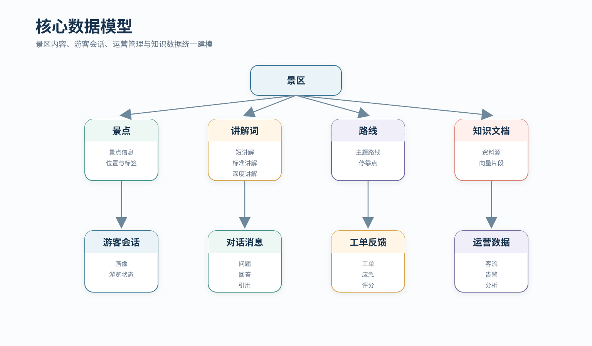
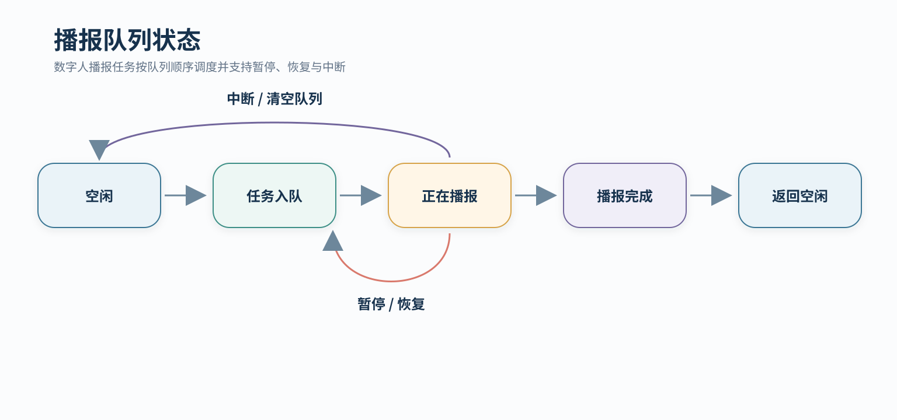
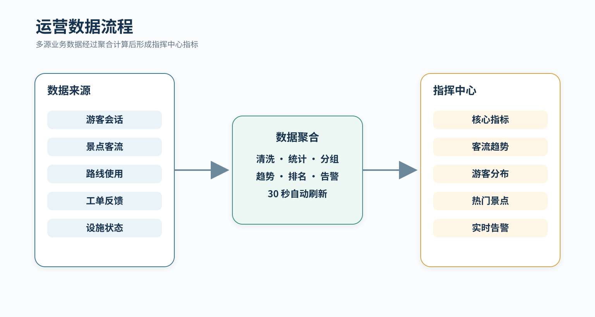
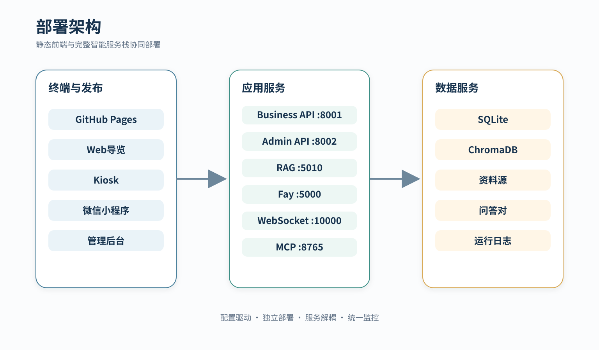
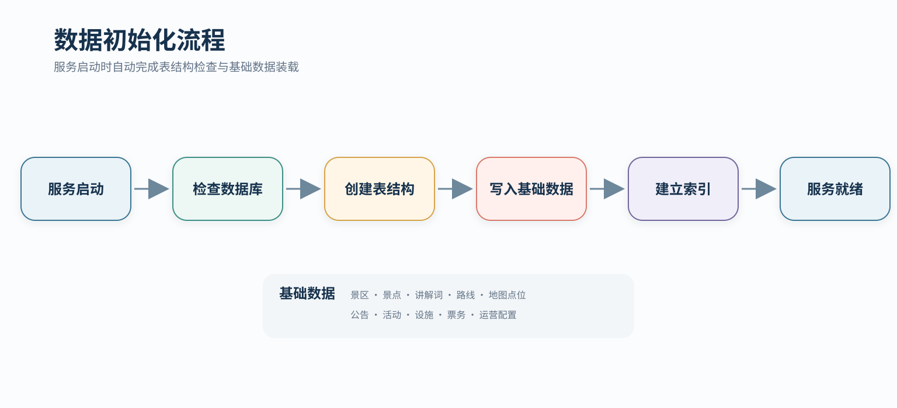

# 灵山胜境智慧景区 AI 数字人导览平台 — 方案设计文档

> **文档版本**：v1.2（成果交付版）  
> **编制日期**：2026年7月14日  
> **项目版本**：Software-Digital-human 完整交付版  
> **文档定位**：系统架构、数据模型、核心流程、接口与部署设计


*图 1　系统架构*

> [!IMPORTANT]
> 平台采用多终端、双业务服务、RAG 知识中枢与数字人运行时协同架构。Web、Kiosk、微信小程序和运营后台通过统一 API 访问景区数据、知识问答、会话、运营分析与数字人服务。

---

## 0. 架构概览

| 架构域 | 核心组成 | 设计说明 |
|---|---|---|
| 终端层 | Web 导览、Kiosk、小程序、管理后台 | 面向游客与运营人员提供统一交互体验 |
| 服务层 | business-api、admin-api、Express 轻量服务 | 分离游客业务、管理业务与快速演示能力 |
| 智能层 | RAG、LLM、Fay、MCP | 完成检索问答、内容生成、语音播报、口型同步与工具调用 |
| 数据层 | SQLite、ChromaDB、JSON 资料库 | 存储景区业务数据、向量知识、问答对和资料源 |
| 交付层 | GitHub Pages、本地完整服务栈 | 支持静态展示与完整智能服务部署 |

---
## 目录

1. [系统总体架构](#一系统总体架构)
2. [技术选型与理由](#二技术选型与理由)
3. [数据库设计](#三数据库设计)
4. [核心模块详细设计](#四核心模块详细设计)
5. [接口设计](#五接口设计)
6. [部署方案](#六部署方案)

---

## 一、系统总体架构

### 1.1 系统架构

平台采用分层、松耦合的服务架构，终端、业务服务、知识服务、数字人运行时和数据层可独立部署并协同运行。

| 层级 | 组件 | 通信方式 |
|---|---|---|
| 表现层 | Web 导览、Kiosk、管理后台、微信小程序 | HTTP / HTTPS |
| 业务层 | business-api、admin-api、Express 轻量服务 | RESTful API |
| 智能层 | RAG、LLM、Fay、MCP | HTTP、WebSocket、SSE |
| 数据层 | SQLite、ChromaDB、JSON 资料库 | ORM、sqlite3、向量检索、文件持久化 |

数字人播报链路通过 Fay HTTP 接收播报任务，经 TTS 和 LipSync 生成音频与口型序列，再通过 WebSocket 同步至展示终端。

### 1.2 各层职责

| 层次 | 职责 | 关键组件 |
|------|------|----------|
| **用户表现层** | 提供Web端和小程序端的用户交互界面；管理路由与状态；调用后端API获取/提交数据；渲染数字人形象和动态数据 | React 19 SPA、HashRouter、Framer Motion动画、Recharts图表、Live2D Cubism SDK |
| **业务服务层** | 封装核心业务逻辑；协调各子服务调用；统一鉴权和链路追踪；数据格式校验与转换 | FastAPI应用、SQLAlchemy ORM、中间件链（CORS/Trace/鉴权） |
| **AI与知识服务层** | 实现RAG全链路（解析→清洗→分块→Embedding→检索→Fallback）；管理数字人引擎生命周期；提供LLM生成能力 | RAG Engine管线、ChromaDB客户端、sentence-transformers、DeepSeek HTTP Client、Fay MCP协议桥 |
| **数据持久层** | 持久化业务数据和向量数据；提供数据查询接口；管理索引和迁移 | SQLite文件、ChromaDB持久化目录、JSON文件存储 |

### 1.3 系统通信方式

| 通信方向 | 协议 | 数据格式 | 备注 |
|----------|------|----------|------|
| 前端 ↔ 后端API | HTTP/1.1 REST | JSON（统一响应格式 `{code, message, data, trace_id}`） | 8秒超时（读）/ 15秒超时（写） |
| business-api ↔ RAG | HTTP/1.1 REST | JSON（通过rag_proxy模块转发） | 代理层含mock fallback |
| admin-api ↔ RAG | HTTP/1.1 REST | JSON（知识库管理操作） | 全接口需Bearer Token鉴权 |
| Fay数字人 ↔ TTS | 进程内调用 | Python函数调用 | 本地音频设备驱动 |
| Fay数字人 ↔ MCP工具 | WebSocket | JSON-RPC格式 | MCP协议标准 |

---

## 二、技术选型与理由

### 2.1 技术选型一览表

| 层次 | 技术/组件 | 版本 | 用途 | 选型理由 |
|------|-----------|------|------|----------|
| **前端框架** | React | 19.2 | SPA构建 | 组件化开发、Fiber架构性能、生态成熟 |
| **前端构建** | Vite | 8.x | 开发服务器 + 产线构建 | HMR秒级热更新、ESM原生支持、构建快于Webpack 10× |
| **前端语言** | TypeScript | 5.x/6.x | 前端开发语言 | 类型安全、IDE智能提示、减少运行时错误 |
| **前端路由** | react-router-dom | 7.x | SPA路由管理 | HashRouter模式支持静态部署 |
| **UI动画** | Framer Motion | 12.x | 页面过渡动画 | 声明式动画API、布局动画支持 |
| **图表库** | Recharts | 3.x | 运营大屏图表 | 基于React组件、轻量级、灵活度高 |
| **流程编辑器** | ReactFlow | 12.x | 知识库流图 | 节点/边自由编排，支持自定义节点 |
| **C端后端** | FastAPI (Python) | 最新 | 导游业务API | 高性能异步、自动API文档、Pydantic校验 |
| **B端后端** | FastAPI (Python) | 最新 | 管理后台API | 同上，统一技术栈 |
| **RAG服务** | Flask (Python) | 3.x | RAG API | 轻量级、灵活度高于FastAPI的微服务场景 |
| **ORM** | SQLAlchemy | 2.x | 数据库交互 | 成熟稳定、支持ORM与原生SQL切换 |
| **数据库** | SQLite | — | 业务数据持久化 | 零配置、嵌入式、单文件部署；适合原型与轻量级场景 |
| **向量数据库** | ChromaDB | 最新 | 向量存储与检索 | 嵌入式部署、Python原生、轻量级（无独立服务进程） |
| **Embedding模型** | BAAI/bge-small-zh-v1.5 | — | 中文文本向量化 | 384维（平衡速度与精度）、中文优化、MIT开源协议 |
| **LLM** | DeepSeek API | — | 检索增强生成 | 中文能力强、性价比高、API延迟低 |
| **数字人框架** | Fay | 社区版 | 数字人引擎 | 支持Live2D+TTS+ASR、MCP协议扩展、开源 |
| **ASR** | Web Speech API / 阿里云 | — | 语音识别 | 浏览器原生支持免插件、fallback至云端 |
| **TTS** | 火山引擎/阿里云/Edge TTS | — | 语音合成 | 多引擎可选、中文自然度高 |

### 2.2 关键选型理由说明

**前端：React 19 + Vite 组合**  
React 19 提供了 React Server Components、Actions、use() API 等新版特性，配合 Vite 8.x 的 ESM原生开发服务器，实现秒级热更。TypeScript 5/6 的类型体操能力保证了大型 SPA 的代码可维护性。纯手写 CSS（无 Tailwind/MUI）的选择基于控制最终产物体积和保持设计自由度的考虑。

**后端：FastAPI 统一技术栈**  
导游业务 API 和管理后台 API 均使用 FastAPI，利用其异步原生特性和自动 OpenAPI 文档生成能力，降低了前后端联调成本。RAG 服务独立使用 Flask，是因为 RAG 服务是 CPU 密集型任务（Embedding 推理 + 向量检索），需要在独立进程中运行以避免阻塞业务 API 的事件循环，同时保持隔离便于独立扩容。

**知识库：ChromaDB + bge-small-zh-v1.5**  
ChromaDB 作为嵌入式向量数据库，无需独立服务进程，与 RAG 服务同进程运行，简化了部署拓扑。bge-small-zh-v1.5（384维）在中文语义检索任务上表现优异（MTEB中文榜TOP级别），且模型体积小（~30MB），可在 CPU 上以毫秒级完成推理。

**数字人：Fay 框架 + MCP 协议**  
Fay 是社区成熟的开源数字人框架，内置 Live2D 渲染、TTS/ASR 管线、播报队列管理。通过 MCP（Model Context Protocol）协议桥接，实现了数字人与 RAG 知识库的工具调用解耦，使得知识检索能力可作为数字人的 "技能插件" 动态接入。

---

## 三、数据库设计

### 3.1 实体关系说明



*图 2　数据模型*

数据模型围绕景区内容、游客会话、运营管理和知识数据四个领域组织。景点与讲解词、路线、知识文档形成内容底座；游客会话关联消息、到达、路线和反馈；运营数据汇总工单、告警与分析指标。
### 3.2 核心数据表结构

#### 3.2.1 景点表 (spots)

| 字段名 | 类型 | 约束 | 说明 |
|--------|------|------|------|
| id | String(32) | PK | 景点编号，如 LS-001 |
| scenic_id | String(32) | NOT NULL, INDEX | 所属景区编号，默认 SA-001 |
| name | String(100) | NOT NULL | 景点名称 |
| name_en | String(100) | DEFAULT '' | 英文名称 |
| tags | JSON | DEFAULT [] | 标签数组，如 ["佛教","建筑","地标"] |
| location | String(200) | DEFAULT '' | 位置描述 |
| summary | Text | DEFAULT '' | 简短摘要（30字内） |
| intro | Text | DEFAULT '' | 详细文字介绍 |
| highlights | JSON | DEFAULT [] | 亮点列表 |
| source | String(50) | DEFAULT 'public_demo_package' | 数据来源标记 |
| freshness_level | String(20) | DEFAULT 'high' | 时效等级 |

#### 3.2.2 景点讲解词表 (spot_guides)

| 字段名 | 类型 | 约束 | 说明 |
|--------|------|------|------|
| id | String(32) | PK | 主键 |
| spot_id | String(32) | NOT NULL, FK→spots.id, INDEX | 归属景点 |
| short_text | Text | DEFAULT '' | 简短讲解（约30字，用于快速播报） |
| brief_text | Text | DEFAULT '' | 标准讲解（约200字） |
| long_text | Text | DEFAULT '' | 详细讲解（约500字，深度文化解读） |
| fallback_text | Text | DEFAULT '' | 兜底讲解（无法获取时展示） |

#### 3.2.3 路线表 (routes)

| 字段名 | 类型 | 约束 | 说明 |
|--------|------|------|------|
| id | String(32) | PK | 路线编号，如 RT-001 |
| scenic_id | String(32) | INDEX | 所属景区，默认 SA-001 |
| name | String(100) | NOT NULL | 路线名称 |
| type | String(32) | DEFAULT 'general' | 路线类型：culture / nature / family / general |
| duration | String(50) | DEFAULT '' | 预计游览时长 |
| persona | String(200) | DEFAULT '' | 适合人群描述 |
| tips | Text | DEFAULT '' | 游览小贴士 |
| source | String(50) | DEFAULT 'public_demo_package' | 数据来源 |

#### 3.2.4 路线停靠点表 (route_stops)

| 字段名 | 类型 | 约束 | 说明 |
|--------|------|------|------|
| id | String(32) | PK | 主键 |
| route_id | String(32) | NOT NULL, FK→routes.id, INDEX | 所属路线 |
| order | Integer | DEFAULT 0 | 停靠顺序 |
| spot_id | String(32) | DEFAULT '' | 景点编号 |
| spot_name | String(100) | DEFAULT '' | 景点名称（冗余字段，减少JOIN） |
| stay_duration | String(50) | DEFAULT '' | 建议停留时长 |
| description | Text | DEFAULT '' | 停靠点说明 |

#### 3.2.5 游客会话表 (sessions)

| 字段名 | 类型 | 约束 | 说明 |
|--------|------|------|------|
| id | String(36) | PK, DEFAULT uuid4 | 会话ID |
| profile | JSON | DEFAULT {} | 游客画像（兴趣偏好等） |
| source | String(32) | DEFAULT 'web' | 来源：web / miniprogram / fay |
| language | String(10) | DEFAULT 'zh' | 使用语言 |
| current_spot_id | String(32) | NULLABLE | 当前位置（景点ID） |
| current_route_id | String(32) | NULLABLE | 当前路线 |
| status | String(20) | DEFAULT 'active' | 状态：active / inactive / expired |
| created_at | String(32) | DEFAULT utcnow | 创建时间 ISO格式 |
| updated_at | String(32) | DEFAULT utcnow | 更新时间 ISO格式 |

#### 3.2.6 对话消息表 (messages)

| 字段名 | 类型 | 约束 | 说明 |
|--------|------|------|------|
| id | String(36) | PK, DEFAULT uuid4 | 消息ID |
| session_id | String(36) | NOT NULL, FK→sessions.id, INDEX | 所属会话 |
| role | String(10) | DEFAULT 'user' | 角色：user / assistant / system |
| text | Text | DEFAULT '' | 消息文本 |
| citations | JSON | DEFAULT [] | 引用来源列表 |
| fallback | Boolean | DEFAULT FALSE | 是否触发兜底 |
| fallback_reason | String(100) | NULLABLE | 兜底触发原因 |
| confidence | Float | NULLABLE | 置信度得分 |
| speech_state | String(20) | DEFAULT 'done' | 播报状态：queued / speaking / done / interrupted |
| duration_ms | Integer | NULLABLE | 处理耗时（毫秒） |
| created_at | String(32) | DEFAULT utcnow | 创建时间 |

#### 3.2.7 景点POI表 (map_pois)

| 字段名 | 类型 | 约束 | 说明 |
|--------|------|------|------|
| id | String(32) | PK | POI编号 |
| scenic_id | String(32) | INDEX | 所属景区 |
| name | String(100) | NOT NULL | POI名称 |
| name_en | String(100) | DEFAULT '' | 英文名称 |
| category | String(32) | DEFAULT 'spot' | 类型：spot / entrance / exit / toilet / parking / restaurant / help_point / closed_area |
| latitude | Float | NOT NULL | 纬度 |
| longitude | Float | NOT NULL | 经度 |
| address | String(200) | DEFAULT '' | 地址 |
| tags | JSON | DEFAULT [] | 标签 |
| images | JSON | DEFAULT [] | 图片URL列表 |
| phone | String(32) | DEFAULT '' | 联系电话 |
| open_time | String(100) | DEFAULT '' | 开放时间 |
| status | String(20) | DEFAULT 'open' | 状态：open / closed / temporary_closed |

#### 3.2.8 工单表 (work_orders)

| 字段名 | 类型 | 约束 | 说明 |
|--------|------|------|------|
| id | String(36) | PK, DEFAULT uuid4 | 工单ID |
| session_id | String(36) | NULLABLE | 关联会话（应用级引用） |
| category | String(32) | DEFAULT 'complaint' | 分类：complaint / suggestion / repair / other |
| description | Text | DEFAULT '' | 问题描述 |
| location | String(200) | DEFAULT '' | 位置 |
| images | JSON | DEFAULT [] | 图片 |
| contact | String(100) | DEFAULT '' | 联系方式 |
| status | String(20) | DEFAULT 'pending' | 状态：pending / processing / resolved / closed |
| handler | String(36) | NULLABLE, FK→admin_users.id | 处理人（关联管理员用户） |
| resolution | Text | NULLABLE | 处理结果 |
| created_at | String(32) | DEFAULT utcnow | 创建时间 |
| updated_at | String(32) | DEFAULT utcnow | 更新时间 |

#### 3.2.9 管理员用户表 (admin_users)

管理员账号信息，支持 RBAC 角色授权。

| 字段名 | 类型 | 约束 | 说明 |
|--------|------|------|------|
| id | String(36) | PK, DEFAULT uuid4 | 用户ID |
| username | String(50) | UNIQUE, NOT NULL, INDEX | 登录用户名 |
| password_hash | String(128) | NOT NULL | 密码哈希（SHA-256 / bcrypt） |
| display_name | String(100) | DEFAULT '' | 显示名称 |
| role_id | String(32) | FK→admin_roles.id, NULLABLE | 所属角色 |
| is_active | Boolean | DEFAULT TRUE | 是否启用 |
| last_login | String(32) | NULLABLE | 最后登录时间 |
| created_at | String(32) | DEFAULT utcnow | 创建时间 |

#### 3.2.10 角色表 (admin_roles)

定义管理后台的角色类型，与需求分析中的角色矩阵对应。

| 字段名 | 类型 | 约束 | 说明 |
|--------|------|------|------|
| id | String(32) | PK | 角色编号 |
| name | String(50) | UNIQUE, NOT NULL | 角色名称（如 admin / knowledge_manager / operator / service_agent） |
| description | String(200) | DEFAULT '' | 角色描述 |
| created_at | String(32) | DEFAULT utcnow | 创建时间 |

#### 3.2.11 权限表 (admin_permissions)

RBAC 细粒度权限条目，每条记录定义某个角色对某类资源的操作权限。

| 字段名 | 类型 | 约束 | 说明 |
|--------|------|------|------|
| id | String(36) | PK, DEFAULT uuid4 | 权限ID |
| role_id | String(32) | NOT NULL, FK→admin_roles.id, INDEX | 所属角色 |
| resource | String(50) | NOT NULL | 资源类型，如 spots / notices / knowledge / system / digital_human / work_orders |
| action | String(20) | NOT NULL | 操作：create / read / update / delete / publish |
| scope | String(50) | DEFAULT '*' | 作用域：'*'=全部，或具体ID |

#### 3.2.12 管理员登录会话表 (admin_session_tokens)

管理员登录后的 token 会话，用于鉴权中间件验证。

| 字段名 | 类型 | 约束 | 说明 |
|--------|------|------|------|
| id | String(36) | PK, DEFAULT uuid4 | 记录ID |
| user_id | String(36) | NOT NULL, FK→admin_users.id, INDEX | 关联管理员 |
| token | String(128) | UNIQUE, NOT NULL, INDEX | 会话 token |
| expires_at | String(32) | NOT NULL | 过期时间 |
| created_at | String(32) | DEFAULT utcnow | 创建时间 |

#### 3.2.13 票种定义表 (ticket_products)

景区票务信息（只读展示，不做交易系统）。

| 字段名 | 类型 | 约束 | 说明 |
|--------|------|------|------|
| id | String(32) | PK | 票种编号 |
| scenic_id | String(32) | INDEX | 所属景区 |
| name | String(100) | NOT NULL | 票种名称（如"成人票""学生票"） |
| price | Float | DEFAULT 0 | 价格 |
| status | String(20) | DEFAULT 'available' | 状态：available / sold_out / closed |
| description | Text | DEFAULT '' | 说明文字 |

#### 3.2.14 公告表 (notices)

景区公告信息，运营人员通过管理后台发布。

| 字段名 | 类型 | 约束 | 说明 |
|--------|------|------|------|
| id | String(32) | PK | 公告编号 |
| scenic_id | String(32) | INDEX | 所属景区 |
| type | String(20) | DEFAULT 'info' | 类型：info / alert / warning |
| title | String(200) | NOT NULL | 公告标题 |
| content | Text | DEFAULT '' | 公告内容 |
| active | Boolean | DEFAULT TRUE | 是否生效 |
| expires_at | String(32) | DEFAULT '' | 过期时间 |

#### 3.2.15 活动/演出表 (events)

景区内定时或常设活动、演出信息。

| 字段名 | 类型 | 约束 | 说明 |
|--------|------|------|------|
| id | String(32) | PK | 活动编号 |
| scenic_id | String(32) | INDEX | 所属景区 |
| name | String(200) | NOT NULL | 活动名称 |
| spot_id | String(32) | DEFAULT '' | 关联景点（可选） |
| time | String(100) | DEFAULT '' | 活动时间描述 |
| description | Text | DEFAULT '' | 活动详情 |

#### 3.2.16 服务设施表 (service_facilities)

景区内基础设施点位信息（厕所、餐饮、停车场、医务室等）。

| 字段名 | 类型 | 约束 | 说明 |
|--------|------|------|------|
| id | String(32) | PK | 设施编号 |
| scenic_id | String(32) | INDEX | 所属景区 |
| category | String(32) | NOT NULL | 分类：toilet / restaurant / parking / help_point |
| name | String(100) | NOT NULL | 设施名称 |
| location | String(200) | DEFAULT '' | 位置描述 |
| location_coords | JSON | DEFAULT NULL | 经纬度坐标 {lat, lng} |

#### 3.2.17 用户反馈表 (feedbacks)

游客提交的对话评价与反馈。

| 字段名 | 类型 | 约束 | 说明 |
|--------|------|------|------|
| id | String(36) | PK, DEFAULT uuid4 | 反馈ID |
| session_id | String(36) | FK→sessions.id, NULLABLE | 关联会话 |
| message_id | String(36) | NULLABLE | 关联消息 |
| rating | Integer | DEFAULT 5 | 评分（1-5星） |
| resolved | Boolean | DEFAULT TRUE | 是否已处理 |
| comment | Text | DEFAULT '' | 评论内容 |
| created_at | String(32) | DEFAULT utcnow | 创建时间 |

#### 3.2.18 到达事件表 (arrival_events)

游客到达景点的打卡记录。

| 字段名 | 类型 | 约束 | 说明 |
|--------|------|------|------|
| id | String(36) | PK, DEFAULT uuid4 | 事件ID |
| session_id | String(36) | NOT NULL, FK→sessions.id, INDEX | 关联会话 |
| spot_id | String(32) | NOT NULL | 到达的景点 |
| location | JSON | DEFAULT NULL | 上报位置坐标 |
| trigger | String(20) | DEFAULT 'manual' | 触发方式：manual / scan / gps / beacon |
| accepted | Boolean | DEFAULT TRUE | 是否被系统接受 |
| speech_state | String(20) | DEFAULT 'queued' | 播报状态：queued / speaking / done |
| created_at | String(32) | DEFAULT utcnow | 创建时间 |

#### 3.2.19 二维码绑定规则表 (qr_code_rules)

景点/票务/活动的二维码扫码规则。

| 字段名 | 类型 | 约束 | 说明 |
|--------|------|------|------|
| id | String(32) | PK | 规则编号 |
| code | String(100) | UNIQUE, NOT NULL, INDEX | 扫码得到的 code |
| target_type | String(20) | NOT NULL | 目标类型：spot / ticket / event / device |
| target_id | String(36) | NOT NULL | 目标主键 |
| description | String(200) | DEFAULT '' | 规则描述 |
| active | Boolean | DEFAULT TRUE | 是否生效 |
| expires_at | String(32) | DEFAULT '' | 过期时间 |
| created_at | String(32) | DEFAULT utcnow | 创建时间 |

#### 3.2.20 排队资源表 (queue_resources)

可预约/排队的资源（演出场次、热门点位等）。

| 字段名 | 类型 | 约束 | 说明 |
|--------|------|------|------|
| id | String(32) | PK | 资源编号 |
| name | String(100) | NOT NULL | 资源名称 |
| resource_type | String(20) | DEFAULT 'show' | 类型：show / spot / event |
| spot_id | String(32) | DEFAULT '' | 关联景点 |
| capacity | Integer | DEFAULT 100 | 最大容量 |
| current_count | Integer | DEFAULT 0 | 当前排队人数 |
| status | String(20) | DEFAULT 'open' | 状态：open / paused / closed |
| schedule | String(100) | DEFAULT '' | 场次时间描述 |

#### 3.2.21 排队号表 (queue_tickets)

游客领取的排队号码。

| 字段名 | 类型 | 约束 | 说明 |
|--------|------|------|------|
| id | String(36) | PK, DEFAULT uuid4 | 排队号ID |
| resource_id | String(32) | NOT NULL, FK→queue_resources.id, INDEX | 关联资源 |
| session_id | String(36) | NOT NULL, FK→sessions.id | 关联会话 |
| queue_number | Integer | NOT NULL | 排队序号 |
| status | String(20) | DEFAULT 'waiting' | 状态：waiting / called / served / expired / cancelled |
| call_count | Integer | DEFAULT 0 | 叫号次数 |
| called_at | String(32) | NULLABLE | 最后叫号时间 |
| created_at | String(32) | DEFAULT utcnow | 创建时间 |

#### 3.2.22 应急求助表 (emergency_requests)

游客发起的 SOS / 医疗 / 走失等紧急求助。

| 字段名 | 类型 | 约束 | 说明 |
|--------|------|------|------|
| id | String(36) | PK, DEFAULT uuid4 | 求助ID |
| session_id | String(36) | NOT NULL | 关联会话（应用级引用） |
| emergency_type | String(20) | NOT NULL | 类型：medical / lost / security / fire / other |
| location | String(200) | DEFAULT '' | 事发位置 |
| location_coords | JSON | DEFAULT NULL | 经纬度坐标 |
| contact | String(100) | DEFAULT '' | 联系方式 |
| description | Text | DEFAULT '' | 情况描述 |
| status | String(20) | DEFAULT 'pending' | 状态：pending / dispatching / arrived / resolved |
| dispatcher | String(50) | NULLABLE | 派遣人 |
| resolved_at | String(32) | NULLABLE | 解决时间 |
| created_at | String(32) | DEFAULT utcnow | 创建时间 |

#### 3.2.23 离线包版本表 (offline_packages)

微信小程序/App 离线资源包版本管理。

| 字段名 | 类型 | 约束 | 说明 |
|--------|------|------|------|
| id | String(36) | PK, DEFAULT uuid4 | 记录ID |
| version | String(20) | NOT NULL | 版本号 |
| platform | String(20) | DEFAULT 'all' | 平台：all / ios / android / mp |
| url | String(500) | DEFAULT '' | 下载地址 |
| file_hash | String(64) | DEFAULT '' | 文件校验码 |
| size_bytes | Integer | DEFAULT 0 | 文件大小 |
| changelog | Text | DEFAULT '' | 更新日志 |
| mandatory | Boolean | DEFAULT FALSE | 是否强制更新 |
| created_at | String(32) | DEFAULT utcnow | 创建时间 |

#### 3.2.24 内容版本表 (content_versions)

管理后台内容发布审批流的版本管理。

| 字段名 | 类型 | 约束 | 说明 |
|--------|------|------|------|
| id | String(36) | PK, DEFAULT uuid4 | 版本ID |
| content_type | String(32) | NOT NULL, INDEX | 内容类型：spot / notice / event / ticket / guide |
| content_id | String(32) | NOT NULL | 对应业务表主键 |
| version | Integer | DEFAULT 1 | 版本号 |
| status | String(20) | DEFAULT 'draft' | 状态：draft / review / published / rejected / archived |
| data | JSON | DEFAULT {} | 完整版本快照 |
| change_log | String(500) | DEFAULT '' | 变更说明 |
| created_by | String(36) | FK→admin_users.id, NULLABLE | 创建人 |
| reviewed_by | String(36) | FK→admin_users.id, NULLABLE | 审核人 |
| reviewed_at | String(32) | NULLABLE | 审核时间 |
| reject_reason | String(500) | NULLABLE | 驳回原因 |
| published_at | String(32) | NULLABLE | 发布时间 |
| created_at | String(32) | DEFAULT utcnow | 创建时间 |

#### 3.2.25 数字人人设配置表 (persona_configs)

数字人的角色人设、语气、系统提示词等配置。

| 字段名 | 类型 | 约束 | 说明 |
|--------|------|------|------|
| id | String(32) | PK | 人设编号 |
| name | String(100) | NOT NULL | 人设名称 |
| description | Text | DEFAULT '' | 人设描述 |
| tone | String(32) | DEFAULT 'friendly' | 语气风格 |
| system_prompt | Text | DEFAULT '' | 系统提示词 |
| fallback_policy | JSON | DEFAULT {} | 兜底策略配置 |
| tools_enabled | JSON | DEFAULT [] | 启用的工具列表 |
| status | String(20) | DEFAULT 'active' | 状态：active / draft / archived |
| version | Integer | DEFAULT 1 | 版本号 |
| updated_at | String(32) | DEFAULT utcnow | 更新时间 |

#### 3.2.26 播报记录表 (broadcast_logs)

数字人播报操作的审计日志。

| 字段名 | 类型 | 约束 | 说明 |
|--------|------|------|------|
| id | String(36) | PK, DEFAULT uuid4 | 记录ID |
| text | Text | NOT NULL | 播报文本 |
| target | String(20) | DEFAULT 'all' | 播报目标范围 |
| target_id | String(36) | NULLABLE | 目标ID |
| priority | String(10) | DEFAULT 'normal' | 优先级 |
| status | String(20) | DEFAULT 'queued' | 状态：queued / sending / sent / failed |
| error | Text | NULLABLE | 错误信息 |
| created_by | String(36) | FK→admin_users.id, NULLABLE | 操作人 |
| created_at | String(32) | DEFAULT utcnow | 创建时间 |

#### 3.2.27 ChromaDB 向量文档元数据

| 元数据字段 | 类型 | 说明 |
|-----------|------|------|
| chunk_id | string | chunk唯一标识 |
| source_name | string | 来源资料名称 |
| source_file | string | 源文件名 |
| domain | string | 领域分类（spot_detail / guide / ticket / event / service / notice） |
| scenic_id | string | 所属景区ID |
| spot_id | string | 关联景点ID（可选） |
| section | string | 章节号（可选） |
| authority_level | string | 权威等级：official / authorized / user |
| freshness_level | string | 时效等级：high / medium / low |
| page | integer | 页码（可选） |

### 3.3 索引策略

| 表名 | 索引字段 | 索引类型 | 用途 |
|------|----------|----------|------|
| spots | scenic_id | B-tree | 按景区查询景点列表 |
| spot_guides | spot_id | B-tree | 按景点ID查询讲解词 |
| routes | scenic_id | B-tree | 按景区查询路线 |
| route_stops | route_id | B-tree | 按路线查询停靠点 |
| sessions | status | B-tree | 按状态筛选活跃会话 |
| messages | session_id | B-tree | 按会话查询历史消息 |
| messages | role | B-tree | 按角色筛选消息 |
| map_pois | scenic_id | B-tree | 按景区查询POI |
| map_pois | category | B-tree | 按分类筛选POI |
| work_orders | status | B-tree | 按状态查询工单 |
| work_orders | handler | B-tree | 按处理人查询工单 |
| feedbacks | session_id | B-tree | 按会话查询反馈 |
| arrival_events | session_id | B-tree | 按会话查询到达事件 |
| ticket_products | scenic_id | B-tree | 按景区查询票种 |
| notices | scenic_id | B-tree | 按景区查询公告 |
| events | scenic_id | B-tree | 按景区查询活动 |
| service_facilities | scenic_id | B-tree | 按景区查询服务设施 |
| service_facilities | category | B-tree | 按分类筛选设施 |
| emergencies | status | B-tree | 按状态筛选应急求助 |
| queue_tickets | resource_id | B-tree | 按资源查询排队号 |
| queue_tickets | session_id | B-tree | 按会话查询排队号 |
| queue_resources | status | B-tree | 按状态筛选资源 |
| content_versions | content_type | B-tree | 按内容类型查询版本 |
| admin_users | username | UNIQUE | 用户名唯一性约束 + 登录查询 |
| admin_users | role_id | B-tree | 按角色查询用户列表 |
| admin_session_tokens | token | UNIQUE | token 快速查找 + 唯一性 |
| admin_session_tokens | user_id | B-tree | 按用户查询所有会话 |
| admin_permissions | role_id | B-tree | 按角色查询权限列表 |
| qr_code_rules | code | UNIQUE | 二维码唯一性约束 + 快速查找 |

---

## 四、核心模块详细设计

### 4.1 RAG知识检索管线（核心模块一）

RAG管线是整个系统的知识中枢，承担"文档→知识→答案"的全链路转换。以下按执行顺序逐阶段说明。

#### 4.1.1 RAG 管线全流程


*图 3　知识问答*

| 阶段 | 处理内容 | 输出 |
|---|---|---|
| 查询接入 | 接收游客问题并清洗输入 | 标准化 Query |
| 意图识别 | 判断景点、门票、路线、服务、文化等意图 | intent + domains |
| 向量化 | 使用中文 Embedding 模型生成语义向量 | query embedding |
| 知识检索 | 在 ChromaDB 中执行 top-k 与元数据过滤 | contexts + scores |
| 可信判断 | 完成相关度、敏感信息与回答策略判定 | answerable + fallback |
| 回答生成 | 结合上下文生成回答并构建引用 | answer + citations + latency |

RAG 服务同时提供资料入库、索引重建、问答对管理、资料源管理、统计与调试能力，构成完整知识治理闭环。

#### 4.1.2 意图识别伪代码

```
FUNCTION classify_intent(query: String) -> {intent: String, domains: List[String]}
    INTENT_MAP = [
        (["多高","多大","多少米","多长","重量","面积"],       "spot_fact",  ["spot_detail","guide"]),
        (["门票","价格","多少钱","票价","优惠","免费"],       "ticket",     ["ticket","guide"]),
        (["几点","时间","开放","表演","演出","什么时候"],     "schedule",   ["event","guide","spot_detail"]),
        (["路线","怎么走","导航","游览","推荐","玩"],        "route",      ["guide"]),
        (["小孩","亲子","带娃","儿童","家庭"],               "family",     ["guide"]),
        (["电话","客服","联系","投诉","急救","医疗"],        "service",    ["service"]),
        (["公告","通知","闭园","暂停","天气","下雨"],        "notice",     ["notice","event"]),
        (["停车","厕所","卫生间","餐饮","吃饭","住宿"],      "facility",   ["service","guide"]),
        (["历史","文化","故事","为什么","介绍","背景"],       "culture",    ["spot_detail","guide"]),
    ]
    
    FOR (keywords, intent, domains) IN INTENT_MAP:
        IF ANY(kw IN query FOR kw IN keywords):
            RETURN {intent, domains}
    
    RETURN {intent: "general", domains: []}
END FUNCTION
```

#### 4.1.3 文档入库管线伪代码

```
FUNCTION ingest_document(filepath, metadata, chunk_size, overlap):
    job_id = UUID()
    
    // Step 1: 文档解析
    raw_text, parse_meta = parse_document(filepath)  // 支持 .md / .docx / .txt
    
    // Step 2: 文本清洗
    cleaned_text = clean_text(raw_text)
    // 2a. 去除HTML标签
    // 2b. 去除重复行（similarity > 0.90）
    // 2c. 检测并移除乱码（连续非UTF8字符 > 3 或 不可见字符比 > 5%）
    
    // Step 3: 语义分块
    chunks = chunk_text(cleaned_text, chunk_size=512, overlap=64)
    // 策略：递归分割（优先按段落 → 再按句子 → 最后按token数截断）
    
    // Step 4: 批量向量化
    texts = [c.text FOR c IN chunks]
    embeddings = embedder.encode_batch(texts)  // 批量推理，提高吞吐
    
    // Step 5: 入库 ChromaDB
    vector_store.upsert(chunks, embeddings)
    
    RETURN {job_id, success: True, chunks: len(chunks), elapsed}
END FUNCTION
```

### 4.2 数字人人机交互模块（核心模块二）

#### 4.2.1 数字人播报与 LipSync 数据流


*图 4　口型同步*

系统将知识回答提交至 TTS 引擎生成语音，再以 50ms 为单位分析音频能量，映射为 viseme 序列并通过 WebSocket 同步至数字人渲染端，实现语音、嘴型和播报状态的一致输出。
#### 4.2.2 口型同步算法说明

口型同步是本系统的关键技术点之一。算法流程如下：

```
INPUT: 音频文件 (MP3/WAV)

1. 音频分帧 (Frame Analysis)
   pydub 以 50ms 为窗口对音频分帧，每帧计算 RMS 振幅值。
   帧率：20 fps（1000ms ÷ 50ms = 20帧/秒）

2. 振幅归一化 (Amplitude Normalization)
   normalized = min(1.0, rms / threshold)
   其中 threshold = 动态平均振幅的 1.5 倍

3. Viseme 映射 (Viseme Mapping)
   normalized < 0.05  → viseme = "sil"  （静音，嘴闭合）
   0.05 ≤ n < 0.20   → viseme = "PP"   （唇微张）
   0.20 ≤ n < 0.35   → viseme = "TH"   （半张）
   0.35 ≤ n < 0.50   → viseme = "DD"   （中等开合）
   0.50 ≤ n < 0.70   → viseme = "E"    （较大开合）
   0.70 ≤ n < 0.85   → viseme = "oh"   （大张/圆唇）
   n ≥ 0.85          → viseme = "aa"   （最大开合）

4. WebSocket 传输
   通过 WS 通道发送 viseme 序列到前端

5. 前端渲染
   Lipsync.ts 中的 visemeMap 将 viseme 名 → ParamMouthOpenY 值
   使用线性插值平滑过渡（transition: 50ms ease）
```

#### 4.2.3 播报队列管理状态机



*图 5　播报队列*

播报任务按照入队顺序执行，支持暂停、恢复、中断和清空队列。任务完成后自动返回空闲状态并继续处理下一条播报。

### 4.3 运营指挥中心模块（核心模块三）

#### 4.3.1 数据聚合与展示流程



*图 6　运营数据*

指挥中心汇总游客会话、景点客流、路线使用、工单反馈和设施状态，经过清洗、统计、趋势计算、排名和告警分析后，形成核心指标、客流趋势、游客分布、热门景点和实时告警。
#### 4.3.2 数据聚合逻辑

```
FUNCTION aggregate_command_center_data():
    // 实时KPI（来自模拟/seed数据 + 实时计算）
    kpis = {
        today_visitors:     COUNT(active_sessions) + seed_base_visitors,
        realtime_in_park:   COUNT(sessions WHERE status="active"),
        today_revenue:      seed_today_revenue,
        today_satisfaction: AVG(feedback.rating) WHERE created_at = today,
        crowd:              CALC_CROWD_LEVEL(realtime_in_park, park_capacity)
    }
    
    // 历史趋势（月粒度）
    monthly = seed_monthly_data  // 预置12个月数据
    
    // 分布分析
    distributions = {
        age:        CALC_AGE_DIST(active_sessions.profile.age_group),
        gender:     CALC_GEN_DIST(active_sessions.profile.gender),
        spending:   seed_spending_pattern,
        satisfaction: CALC_SAT_DIST(feedbacks WHERE created_at >= 7_days_ago)
    }
    
    // 热点与告警
    top_spots = QUERY spots ORDER BY current_visitors DESC LIMIT 5
    alerts = CHECK_ALERT_CONDITIONS()
    // 触发条件：设施负载>80% → warn；客流>阈值 → info
    
    RETURN {source: "backend_mock", kpis, monthly, distributions, top_spots, alerts}
END FUNCTION
```

---

## 五、接口设计

### 5.1 设计规范

各服务尽量遵循统一响应与 trace_id 规范，但鉴权范围按服务域分别执行：

```
响应格式：
{
    "code": 0,            // 0=成功，>0=业务错误
    "message": "success",  // 提示信息
    "data": { ... },       // 业务数据
    "trace_id": "trace_xx" // 链路追踪ID
}

错误码体系：
0     = 成功
10001 = 参数错误（HTTP 400）
10002 = 文件不存在（HTTP 404）
40001 = 鉴权失败（HTTP 401）
40003 = 无权限（HTTP 403）
50001 = 服务器内部错误（HTTP 500）

鉴权方式：
游客公开业务接口默认匿名可用，`/internal/*` 使用服务间 Token；
admin-api 除登录、健康检查与 API 文档外要求 Bearer Token；
RAG 除健康检查外要求 Bearer Token，密钥通过环境变量注入；
管理员由 `ADMIN_BOOTSTRAP_PASSWORD` 引导创建/更新，不在文档中固化默认口令
```

### 5.2 导游业务 API（business-api :8001/v1）

#### 5.2.1 景区与景点

| 方法 | 路径 | 说明 | 请求参数 | 返回数据 |
|------|------|------|----------|----------|
| GET | /v1/scenic-areas/{id} | 景区基础资料 | id (path) | scenic_area对象 |
| GET | /v1/spots | 景点列表 | page, page_size, search(可选) | {items: Spot[], pagination} |
| GET | /v1/spots/{id} | 景点详情 | id (path) | Spot对象 |
| GET | /v1/spots/{id}/guide | 景点讲解词 | id (path) | SpotGuide对象 |

#### 5.2.2 路线

| 方法 | 路径 | 说明 | 请求参数 | 返回数据 |
|------|------|------|----------|----------|
| GET | /v1/routes | 路线列表 | type(可选) | {items: Route[]} |
| GET | /v1/routes/{id} | 路线详情 | id (path) | Route对象（含stops） |
| POST | /v1/routes/plan | 路线规划 | profile, preferences | 推荐路线列表 |

#### 5.2.3 会话与消息

| 方法 | 路径 | 说明 | 请求参数 | 返回数据 |
|------|------|------|----------|----------|
| POST | /v1/sessions | 创建会话 | {source, language, profile} | session对象 |
| GET | /v1/sessions/{id} | 查询会话 | id (path) | session对象 |
| PATCH | /v1/sessions/{id} | 更新会话 | {current_spot_id, status} | session对象 |
| POST | /v1/sessions/{id}/messages | 记录消息 | {role, text} | message对象 |
| GET | /v1/sessions/{id}/messages | 查询消息 | page, page_size | {items: Message[], pagination} |
| POST | /v1/sessions/{id}/arrival-events | 到达事件 | {spot_id, trigger} | arrival_event对象 |
| POST | /v1/sessions/{id}/feedback | 提交反馈 | {rating, comment} | feedback对象 |

#### 5.2.4 RAG代理（内部转发至RAG服务 :5010）

| 方法 | 路径 | 说明 | 请求参数 | 返回数据 |
|------|------|------|----------|----------|
| POST | /v1/rag/query | 语义检索 | {query, top_k(可选)} | {answerable, contexts, citations, fallback, latencyMs} |

#### 5.2.5 运营数据

| 方法 | 路径 | 说明 | 请求参数 | 返回数据 |
|------|------|------|----------|----------|
| GET | /v1/analytics | 运营概览 | — | analytics对象 |
| GET | /v1/analytics/visitor-behavior | 游客行为 | — | 行为数据 |
| GET | /v1/notices | 公告列表 | — | Notice[] |
| GET | /v1/events | 活动列表 | — | Event[] |
| GET | /v1/services | 服务设施 | category(可选) | ServiceFacility[] |
| GET | /v1/weather | 天气（模拟） | — | weather对象 |
| GET | /v1/queues | 排队（模拟） | — | queue对象 |
| GET | /v1/tickets/products | 票务（模拟） | — | TicketProduct[] |

### 5.3 管理后台 API（admin-api :8002/v1）

#### 5.3.1 认证

| 方法 | 路径 | 说明 | 请求参数 | 返回数据 |
|------|------|------|----------|----------|
| POST | /v1/auth/login | 登录 | {username, password} | {token, user} |
| POST | /v1/auth/logout | 登出 | — | — |
| GET | /v1/auth/me | 当前用户 | — | user对象 |

#### 5.3.2 知识库管理

| 方法 | 路径 | 说明 | 请求参数 | 返回数据 |
|------|------|------|----------|----------|
| GET | /v1/knowledge/status | 知识库状态 | — | {vectors, provider, embedding_model, ...} |
| GET | /v1/knowledge/sources | 资料源列表 | page, page_size | {items: Source[], pagination} |
| POST | /v1/knowledge/sources | 登记资料 | {name, filepath, domain, tags} | source对象 |
| GET | /v1/knowledge/qa | 问答对列表 | page, page_size | {items: QA[], pagination} |
| POST | /v1/knowledge/qa | 录入问答对 | {question, answer, source, domain} | qa对象 |
| POST | /v1/knowledge/ingest | 上传文档入库 | FormData: file + source_name + domain | {job_id, chunks, success} |
| POST | /v1/knowledge/reindex | 重建索引 | {scenic_id, reason} | {status, message} |
| POST | /v1/knowledge/test-query | 测试检索 | {query, top_k} | {answerable, contexts, citations, latencyMs} |
| POST | /v1/knowledge/answer | 检索+LLM生成 | {query, top_k} | {answer, answerable, contexts, tokens, latencyMs} |
| POST | /v1/knowledge/answer-and-broadcast | 检索+LLM+广播 | {query, top_k} | {answer, broadcastStatus, ...} |
| GET | /v1/knowledge/low-confidence-queries | 低置信查询列表 | page, page_size | {items, pagination} |

#### 5.3.3 分析数据

| 方法 | 路径 | 说明 | 请求参数 | 返回数据 |
|------|------|------|----------|----------|
| GET | /v1/admin/analytics/overview | 运营概览 | — | {activeVisitors, totalSpots, pendingWorkOrders, ...} |
| GET | /v1/admin/analytics/spot-heat | 景点热度 | minutes | {items: SpotHeatItem[], totalActive} |
| GET | /v1/admin/analytics/crowd-flow | 客流时段 | — | {items: CrowdFlowItem[]} |
| GET | /v1/admin/analytics/queue | 排队统计 | — | {items: QueueStatItem[]} |
| GET | /v1/admin/analytics/command-center | 指挥中心 | — | CommandCenterData |

#### 5.3.4 数字人配置

| 方法 | 路径 | 说明 | 请求参数 | 返回数据 |
|------|------|------|----------|----------|
| GET | /v1/digital-human/avatars | 形象列表 | — | {items: AvatarItem[]} |
| GET | /v1/digital-human/voices | 音色列表 | — | {items: VoiceItem[]} |

#### 5.3.5 工单与应急

| 方法 | 路径 | 说明 | 请求参数 | 返回数据 |
|------|------|------|----------|----------|
| GET | /v1/work-orders | 工单列表 | page, page_size, status, category | {items, pagination} |
| POST | /v1/work-orders/{id}/handle | 接单处理 | — | 结果 |
| POST | /v1/work-orders/{id}/resolve | 处理完成 | {resolution} | 结果 |
| POST | /v1/work-orders/{id}/close | 关闭工单 | — | 结果 |
| GET | /v1/emergencies | 应急列表 | page, page_size, status | {items, pagination} |
| POST | /v1/emergencies/{id}/dispatch | 派遣处理 | — | 结果 |
| POST | /v1/emergencies/{id}/resolve | 解决 | — | 结果 |
| GET | /v1/feedbacks | 反馈列表 | page, page_size, min_rating | {items, pagination} |

#### 5.3.6 运行时控制

| 方法 | 路径 | 说明 | 请求参数 | 返回数据 |
|------|------|------|----------|----------|
| GET | /v1/runtime/status | 运行状态 | — | {fayOnline, digitalHumanConnected, mcpOnline, ...} |
| GET | /v1/runtime/queue | 播报队列 | — | {queueLength, fayOnline, speaking} |
| POST | /v1/runtime/broadcast | 发送广播 | {text, speaker} | {queued, ...} |
| POST | /v1/runtime/microphone/toggle | 切换麦克风 | — | {microphone, status} |
| POST | /v1/runtime/clear-queue | 清空队列 | — | 结果 |

### 5.4 RAG 知识库服务 API（Flask :5010/api/v1/rag）

| 方法 | 路径 | 鉴权 | 说明 |
|---|---|:---:|---|
| GET | `/health` | 否 | 健康检查 |
| GET | `/stats` | 是 | 向量库与模型统计 |
| POST | `/ingest` | 是 | 文档入库 |
| POST | `/query` | 是 | 语义检索、引用与 fallback |
| POST | `/answer` | 是 | 检索与 LLM 生成 |
| POST | `/rebuild` | 是 | 重建索引 |
| POST | `/debug/raw-query` | 是 | 原始检索调试 |
| GET/POST | `/qa` | 是 | 问答对管理 |
| GET/POST | `/sources` | 是 | 资料源管理 |

---

## 六、部署方案

### 6.1 部署架构



*图 7　部署架构*

平台支持静态前端发布与完整智能服务栈部署。终端通过业务接口访问应用服务，应用服务连接知识问答、数字人、工具服务和数据服务，各组件由统一配置管理并支持独立扩展。
### 6.2 各服务启动方式

| 服务 | 启动方式 | 端口 | 说明 |
|---|---|:---:|---|
| 前端开发 | `cd frontend && npm run dev` | 5173 | Web 导览、Kiosk 与管理后台 |
| 前端构建 | `cd frontend && npm run build` | 静态文件 | GitHub Pages 交付产物 |
| 业务 API | `cd services/scenic-dh-business-api && uvicorn app.main:app --port 8001` | 8001 | 游客业务、会话、消息与景区服务 |
| 管理 API | `cd services/scenic-dh-admin-api && uvicorn app.main:app --port 8002` | 8002 | 后台管理、分析、知识与数字人控制 |
| RAG 服务 | `cd rag && python run_rag_server.py` | 5010 | 知识入库、检索、生成与管理 |
| Fay 运行时 | `python fay_booter.py` | 5000 / 10000 | TTS、口型同步、HTTP 控制与 WebSocket |
| Fay 轻量模式 | `python fay_lite_server.py` | 5000 | 轻量播报与状态服务 |
| MCP 服务 | 按 `faymcp` 配置启动 | 8765 | 工具注册、发现与调用 |
| Express 服务 | `cd backend && npm run dev` | 3001 | 轻量接口与独立展示服务 |

### 6.3 环境要求

| 依赖项 | 版本要求 | 用途 |
|--------|----------|------|
| Node.js | ≥ 18 | 前端构建与运行 |
| Python | ≥ 3.10, ≤ 3.11 | 后端与RAG服务 |
| pip | ≥ 21 | Python依赖管理 |
| npm | ≥ 9 | Node依赖管理 |
| ffmpeg | 任意版本 | pydub音频解析（数字人口型同步） |
| HuggingFace Hub | 最新 | Embedding模型下载（需设置HF_ENDPOINT=https://hf-mirror.com） |

### 6.4 配置管理

所有可配参数通过配置文件和环境变量两级管理：

**环境变量**

| 变量名 | 默认值 | 用途 |
|--------|--------|------|
| RAG_API_KEY | dev-token-123456 | RAG服务鉴权密钥 |
| HF_ENDPOINT | https://hf-mirror.com | HuggingFace镜像地址 |
| PORT | 3001 / 8001 / 8002 | 各服务端口覆盖 |

**配置文件（rag/config/）**

| 文件 | 管理内容 |
|------|----------|
| embedding_config.json | Embedding模型提供商、模型名、设备(cpu/cuda) |
| chunk_config.json | 分块大小(512)、重叠窗口(64) |
| vector_store_config.json | 向量库提供商、ChromaDB持久化路径、集合名 |
| fallback_config.json | 评分阈值(0.5)、top_k范围、敏感词文件路径 |
| cleaning_rules.json | 去重阈值、乱码判定参数 |
| fallback_phrases.json | 各场景兜底回复话术 |

### 6.5 数据初始化



*图 8　数据初始化*

业务服务启动时自动检查数据库结构，完成表创建、基础数据写入和索引建立。初始化内容包括景区、景点、讲解词、路线、地图点位、公告、活动、设施、票务和运营配置。

---

> **文档编制说明**  
> 本方案设计文档依据 GB/T 8567-2006《计算机软件文档编制规范》编写，覆盖系统架构、技术选型、数据模型、核心模块、接口设计与部署方案。
