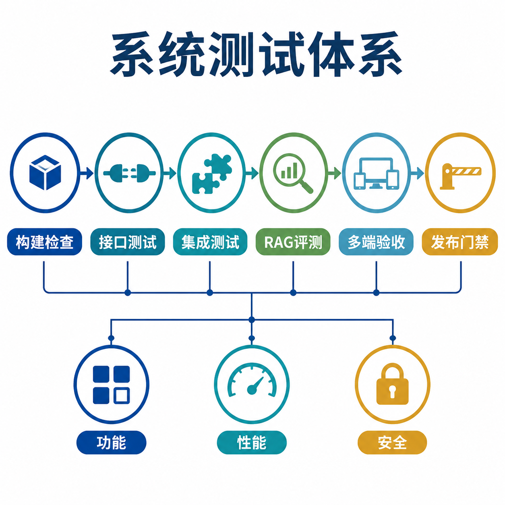
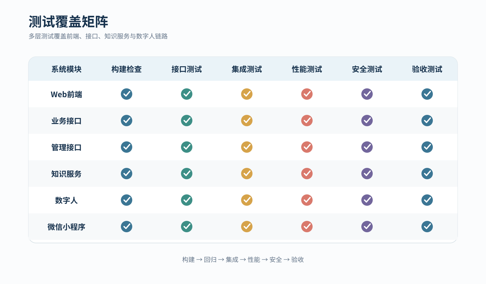
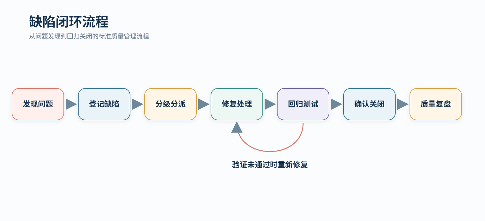

# 灵山胜境智慧景区 AI 数字人导览平台 — 测试说明文档

> **文档版本**：v1.2（成果验收版）  
> **编制日期**：2026年7月14日  
> **项目版本**：Software-Digital-human 完整交付版  
> **文档定位**：测试策略、测试用例、性能方案、质量门禁与验收结论



*图 1　测试体系*

> [!IMPORTANT]
> 项目建立了覆盖前端、业务 API、管理 API、RAG、数字人、小程序与跨服务联调的测试体系，通过自动化测试、构建检查、接口冒烟、质量评估和人工验收共同保障交付质量。

---

## 0. 测试结论

系统测试围绕功能、性能、安全和多端一致性展开，覆盖前端、业务接口、管理接口、知识服务、数字人和微信小程序。测试流程从构建检查开始，依次完成接口回归、跨服务集成、知识问答评测和多端验收。



*图 2　测试覆盖*
---
## 目录

1. [测试策略](#一测试策略)
2. [测试用例设计](#二测试用例设计)
3. [性能测试方案](#三性能测试方案)
4. [缺陷管理](#四缺陷管理)

---

## 一、测试策略

### 1.1 分层测试模型

| 层级 | 测试对象 | 目标 |
|---|---|---|
| L1 构建与静态检查 | TypeScript、Vite、ESLint、Python 模块 | 确保工程可构建、类型正确、代码规范 |
| L2 单元与接口测试 | Express、business-api、admin-api、demo service | 验证输入、边界、业务规则与错误结构 |
| L3 跨服务集成测试 | API、RAG、数据库、Fay、MCP | 验证服务协同、数据一致性与链路追踪 |
| L4 多端验收 | Web、Kiosk、小程序、管理后台、数字人 | 验证完整游客旅程与运营闭环 |
| L5 性能与安全测试 | RAG 延迟、接口吞吐、鉴权、敏感信息 | 验证系统性能、可靠性和安全性 |

### 1.2 测试工具

| 测试对象 | 工具/框架 | 运行方式 |
|---|---|---|
| Web 前端 | TypeScript、Vite、ESLint、浏览器验收 | 构建、静态检查、移动端视口测试 |
| Express API | Node test runner | 自动化回归 |
| FastAPI 服务 | pytest + TestClient | 自动化接口与集成测试 |
| RAG | Python 测试脚本 + Golden Set | 检索、拒答、引用与性能评估 |
| 合同测试 | OpenAPI + smoke 脚本 | 服务启动后执行 |
| 数字人 | 固定音频样本 + LipSync 测试脚本 | 帧级口型与播报验收 |
| 多端验收 | 浏览器、小程序开发者工具、联调环境 | 核心旅程验收 |

### 1.3 测试环境

| 环境 | 用途 | 配置 |
|---|---|---|
| 开发环境 | 日常构建与模块测试 | Windows 11、Node.js、Python、SQLite |
| 集成环境 | API、RAG、Fay 与数据库联调 | 8001/8002/5010/5000/10000/8765 服务栈 |
| 验收环境 | Web、小程序、Kiosk 与管理后台演示 | 完整数据、知识库、数字人和网络配置 |
| 发布环境 | GitHub Pages 与本地服务部署 | 静态前端 + 完整 API 服务 |

### 1.4 测试资产

| 测试文件/资产 | 数量 | 覆盖范围 |
|---|:---:|---|
| `backend/src/app.test.ts` | 12 | Express API 回归 |
| `business-api/tests/test_integration.py` | 27 | 业务全链路 |
| `business-api/tests/test_health.py` | 8 | 健康与基础接口 |
| `admin-api/tests/test_admin.py` | 12 | 管理 API、鉴权与运行时 |
| `demo-mock-service/tests/test_demo.py` | 7 | 轻量服务冒烟 |
| `rag/test_rag.py` | 5 个检查步骤 | RAG 入库、检索、统计与安全策略 |
| OpenAPI / health-check / smoke 脚本 | 多项 | 合同与完整服务栈验收 |

后端自动化测试资产共 66 项，并配套 RAG、LipSync、构建、合同与多端验收流程。

### 1.5 测试执行方式

```powershell
# Frontend
cd frontend
npm run build
npm run lint

# Express backend
cd ../backend
npm test

# Admin API
cd ../services/scenic-dh-admin-api
python -m pytest tests -v

# Business API
cd ../scenic-dh-business-api
python -m pytest tests -v

# Demo service
cd ../scenic-dh-demo-mock-service
python -m pytest tests -v

# RAG
cd ../../../rag
python test_rag.py
```

所有执行结果统一记录测试环境、版本、数据集、模型配置、通过率与耗时，形成可追溯的验收记录。

---

## 二、测试用例设计

### 2.1 测试用例编写规范

每个测试用例遵循统一模板：

| 字段 | 说明 |
|------|------|
| **TC-ID** | 测试用例唯一编号，格式：`{层级}-{模块}-{序号}` |
| **测试名称** | 清晰描述测试场景 |
| **前置条件** | 执行前必须满足的条件 |
| **输入数据** | 测试输入（参数、请求体等） |
| **操作步骤** | 按顺序描述执行动作 |
| **预期结果** | 期望的系统行为/输出 |
| **实际结果** | 由测试执行记录填写 |

### 2.2 测试用例清单

以下按功能模块，列出不少于20个核心测试用例：

---

#### 模块1：RAG 知识检索（M-S-01）

| 字段 | 内容 |
|------|------|
| **TC-ID** | UT-RAG-001 |
| **测试名称** | 可回答问题返回正确上下文 |
| **前置条件** | 灵山数据集已入库（lingshan-dataset.md + lingshan-guide.md ≥ 50 chunks） |
| **输入数据** | query="灵山大佛有多高？" top_k=3 |
| **操作步骤** | ① 调用 engine.query() ② 检查返回结构 |
| **预期结果** | answerable=True, contexts 非空且 ≥ 1 条，第一条 score ≥ 0.5，citations 格式正确含 quote 和 doc_id |
| **实际结果** | |

| 字段 | 内容 |
|------|------|
| **TC-ID** | UT-RAG-002 |
| **测试名称** | 不可回答问题返回 fallback |
| **前置条件** | 同上 |
| **输入数据** | query="今天股票行情怎么样？" top_k=5 |
| **操作步骤** | ① 调用 engine.query() ② 检查 fallback 字段 |
| **预期结果** | answerable=False, contexts=[], fallback.reason ≠ null, fallback.safe_reply 为非空安全回复 |
| **实际结果** | |

| 字段 | 内容 |
|------|------|
| **TC-ID** | UT-RAG-003 |
| **测试名称** | 空库状态下的查询行为 |
| **前置条件** | ChromaDB 已清空（rebuild_index 后） |
| **输入数据** | query="灵山大佛有多高？" top_k=5 |
| **操作步骤** | ① rebuild_index() ② 调用 engine.query() |
| **预期结果** | answerable=False, fallback.reason = "no_relevant_docs" |
| **实际结果** | |

| 字段 | 内容 |
|------|------|
| **TC-ID** | UT-RAG-004 |
| **测试名称** | 敏感信息自动过滤 |
| **前置条件** | 知识库包含含手机号或身份证号的数据 |
| **输入数据** | query="查一下13812345678是谁" |
| **操作步骤** | ① 调用 engine.query() ② 检查是否触发敏感过滤 |
| **预期结果** | answerable=False, fallback.reason 为空或安全拒绝（不泄露实际信息） |
| **实际结果** | |

| 字段 | 内容 |
|------|------|
| **TC-ID** | UT-RAG-005 |
| **测试名称** | 意图识别自动推导 domain 过滤 |
| **前置条件** | 知识库包含多领域数据 |
| **输入数据** | query="门票多少钱？" |
| **操作步骤** | ① 低格调用 engine.query() ② 检查 filters 参数是否包含 domain=["ticket","guide"] |
| **预期结果** | 查询时自动附加 domain 过滤条件，仅检索 ticket 和 guide 领域 |
| **实际结果** | |

| 字段 | 内容 |
|------|------|
| **TC-ID** | UT-RAG-006 |
| **测试名称** | 文档入库管线完整执行 |
| **前置条件** | 测试文档 lingshan-dataset.md 存在 |
| **输入数据** | filepath=rag-knowledge/lingshan-dataset.md, metadata={source_name:"test",domain:"test"} |
| **操作步骤** | ① ingest_document() ② 检查返回 ③ 执行 query 验证 |
| **预期结果** | success=True, chunks ≥ 30（基于文档长度），入库后查询该文档内容可检索到 |
| **实际结果** | |

| 字段 | 内容 |
|------|------|
| **TC-ID** | UT-RAG-007 |
| **测试名称** | 知识库统计信息正确 |
| **前置条件** | 至少一次成功入库 |
| **输入数据** | 无 |
| **操作步骤** | ① 调用 engine.stats() |
| **预期结果** | 返回结构包含 provider, collection, vectors(>0), embedding_model, chunk_size 等字段 |
| **实际结果** | |

---

#### 模块2：导游业务 API（business-api）

| 字段 | 内容 |
|------|------|
| **TC-ID** | IT-BIZ-001 |
| **测试名称** | 分页查询景点列表 |
| **前置条件** | 种子数据已写入（≥ 14个景点） |
| **输入数据** | GET /v1/spots?page=1&page_size=3 |
| **操作步骤** | ① 发送 GET 请求 ② 验证响应 |
| **预期结果** | HTTP 200, code=0, data.items.length=3, data.pagination.total=16+, trace_id 格式正确 |
| **实际结果** | |

| 字段 | 内容 |
|------|------|
| **TC-ID** | IT-BIZ-002 |
| **测试名称** | 景点详情+讲解词联合查询 |
| **前置条件** | 种子数据已写入 |
| **输入数据** | GET /v1/spots/LS-002, GET /v1/spots/LS-002/guide |
| **操作步骤** | ① 查询景点详情 ② 查询讲解词 ③ 比对两者关联 |
| **预期结果** | 详情返回 name="灵山梵宫"；讲解词含 briefText 或 shortText |
| **实际结果** | |

| 字段 | 内容 |
|------|------|
| **TC-ID** | IT-BIZ-003 |
| **测试名称** | 参数校验——分页参数越界 |
| **前置条件** | 无 |
| **输入数据** | GET /v1/spots?page=0&page_size=999 |
| **操作步骤** | ① 发送请求 |
| **预期结果** | HTTP 400, code=10001, message 提示参数越界 |
| **实际结果** | |

| 字段 | 内容 |
|------|------|
| **TC-ID** | IT-BIZ-004 |
| **测试名称** | 路线规划——按兴趣推荐 |
| **前置条件** | 种子数据含 family 类型路线 |
| **输入数据** | POST /v1/routes/plan, body={interests:["亲子"], duration:"4小时"} |
| **操作步骤** | ① 发送 POST 请求 |
| **预期结果** | HTTP 200, data.route.type="family", data.route.stops 非空 |
| **实际结果** | |

| 字段 | 内容 |
|------|------|
| **TC-ID** | IT-BIZ-005 |
| **测试名称** | 完整游客会话生命周期 |
| **前置条件** | 无 |
| **输入数据** | 依次调用：POST /v1/sessions → PATCH → POST messages → GET messages |
| **操作步骤** | ① 创建会话 ② 更新当前位置 ③ 发送用户消息 ④ 查询消息列表 |
| **预期结果** | 每一步返回 code=0，会话状态流转正常，messages 列表非空 |
| **实际结果** | |

| 字段 | 内容 |
|------|------|
| **TC-ID** | IT-BIZ-006 |
| **测试名称** | 到达事件记录正确 |
| **前置条件** | 有活跃会话 |
| **输入数据** | POST /v1/sessions/{sid}/arrival-events, body={spotId:"LS-003", trigger:"demo"} |
| **操作步骤** | ① 发送到达事件 |
| **预期结果** | HTTP 200, data.accepted=True, data.spotId 与输入一致 |
| **实际结果** | |

| 字段 | 内容 |
|------|------|
| **TC-ID** | IT-BIZ-007 |
| **测试名称** | 用户反馈提交与接收 |
| **前置条件** | 有活跃会话，至少有一条助手消息 |
| **输入数据** | POST /v1/sessions/{sid}/feedback, body={type:"feedback", content:"讲解很详细"} |
| **操作步骤** | ① 提交反馈 |
| **预期结果** | HTTP 200, data.feedbackId 非空 |
| **实际结果** | |

| 字段 | 内容 |
|------|------|
| **TC-ID** | IT-BIZ-008 |
| **测试名称** | 不存在的资源返回 404 |
| **前置条件** | 无 |
| **输入数据** | GET /v1/spots/not-found, GET /v1/sessions/missing-session |
| **操作步骤** | ① 分别请求两个不存在的资源 |
| **预期结果** | HTTP 404, code=10002 或 40403 |
| **实际结果** | |

| 字段 | 内容 |
|------|------|
| **TC-ID** | IT-BIZ-009 |
| **测试名称** | 运营辅助信息接口可用 |
| **前置条件** | 种子数据已写入 |
| **输入数据** | GET /v1/notices, GET /v1/events, GET /v1/services, GET /v1/weather, GET /v1/queues, GET /v1/tickets/products |
| **操作步骤** | ① 依次请求所有辅助接口 |
| **预期结果** | 全部返回 HTTP 200, code=0 |
| **实际结果** | |

| 字段 | 内容 |
|------|------|
| **TC-ID** | IT-BIZ-010 |
| **测试名称** | 全链路 trace_id 传递 |
| **前置条件** | 无 |
| **输入数据** | 任一路由 |
| **操作步骤** | ① 发送请求 ② 检查响应头 |
| **预期结果** | 响应头含 x-trace-id 和 x-service |
| **实际结果** | |

---

#### 模块3：管理后台 API（admin-api）

| 字段 | 内容 |
|------|------|
| **TC-ID** | IT-ADM-001 |
| **测试名称** | 鉴权保护——未认证请求被拒绝 |
| **前置条件** | 无 |
| **输入数据** | GET /v1/knowledge/status（不带 Authorization 头） |
| **操作步骤** | ① 发送请求 |
| **预期结果** | HTTP 401 |
| **实际结果** | |

| 字段 | 内容 |
|------|------|
| **TC-ID** | IT-ADM-002 |
| **测试名称** | 登录——错误凭证被拒绝 |
| **前置条件** | 无 |
| **输入数据** | POST /v1/auth/login, body={username:"admin", password:"wrong"} |
| **操作步骤** | ① 发送登录请求 |
| **预期结果** | HTTP 401, code=40100 |
| **实际结果** | |

| 字段 | 内容 |
|------|------|
| **TC-ID** | IT-ADM-003 |
| **测试名称** | 登录成功返回 token 并可查询当前用户 |
| **前置条件** | 通过 `ADMIN_BOOTSTRAP_PASSWORD` 创建启用管理员；测试使用 fixture 账号，不固化默认口令 |
| **输入数据** | POST /v1/auth/login → GET /v1/auth/me（with token） |
| **操作步骤** | ① 登录 ② 用返回的 token 查询 /v1/auth/me |
| **预期结果** | 登录返回 token；me 接口返回 username="admin" |
| **实际结果** | |

| 字段 | 内容 |
|------|------|
| **TC-ID** | IT-ADM-004 |
| **测试名称** | 运行时状态接口返回完整 |
| **前置条件** | admin-api 运行中 |
| **输入数据** | GET /v1/runtime/status（已认证） |
| **操作步骤** | ① 发送请求 |
| **预期结果** | code=0, data 含 fayOnline, mcpOnline, digitalHumanConnected 等字段 |
| **实际结果** | |

---

#### 模块4：C端前端

| 字段 | 内容 |
|------|------|
| **TC-ID** | UT-FE-001 |
| **测试名称** | 登录页路由守卫——未登录重定向 |
| **前置条件** | 浏览器 localStorage 中无 scenic_admin_token |
| **输入数据** | 访问 /dashboard |
| **操作步骤** | ① 打开无痕窗口 ② 访问 /#/dashboard |
| **预期结果** | 自动重定向到 /（登录页） |
| **实际结果** | |

| 字段 | 内容 |
|------|------|
| **TC-ID** | UT-FE-002 |
| **测试名称** | 管理后台懒加载——各页面可正常加载 |
| **前置条件** | 已登录，后端服务可达 |
| **输入数据** | 依次点击导航栏各菜单项 |
| **操作步骤** | ① 登录 ② 依次进入 knowledge / review / digital-human / settings / command / work-orders |
| **预期结果** | 各页面加载不抛错，展示对应的 UI 内容，无白屏或崩溃 |
| **实际结果** | |

| 字段 | 内容 |
|------|------|
| **TC-ID** | UT-FE-003 |
| **测试名称** | C端导游页——景点列表数据展示 |
| **前置条件** | business-api 可达 |
| **输入数据** | 访问 /#/guide |
| **操作步骤** | ① 打开导游页 ② 查看景点列表 |
| **预期结果** | 景点列表展示完整（名称、标签、摘要），无骨架屏卡死 |
| **实际结果** | |

| 字段 | 内容 |
|------|------|
| **TC-ID** | UT-FE-004 |
| **测试名称** | API 不可达时前端优雅降级 |
| **前置条件** | business-api 未启动 |
| **输入数据** | 访问 /#/guide |
| **操作步骤** | ① 停掉后端 ② 刷新导游页 |
| **预期结果** | 页面不崩溃，景点列表区域显示空态提示或加载失败提示，无白屏 |
| **实际结果** | |

---

#### 模块5：数字人交互

| 字段 | 内容 |
|------|------|
| **TC-ID** | UT-DH-001 |
| **测试名称** | 数字人形象列表正确加载 |
| **前置条件** | admin-api 可达，种子数据存在 |
| **输入数据** | GET /v1/digital-human/avatars（已认证） |
| **操作步骤** | ① 发送请求 |
| **预期结果** | code=0, data.items 非空，每项含 id, name, style, gradient |
| **实际结果** | |

| 字段 | 内容 |
|------|------|
| **TC-ID** | UT-DH-002 |
| **测试名称** | 音色列表正确加载 |
| **前置条件** | admin-api 可达 |
| **输入数据** | GET /v1/digital-human/voices（已认证） |
| **操作步骤** | ① 发送请求 |
| **预期结果** | code=0, data.items 含至少一种音色（id, name, desc） |
| **实际结果** | |

---

#### 模块6：数据来源标记校验

| 字段 | 内容 |
|------|------|
| **TC-ID** | IT-DATA-001 |
| **测试名称** | 所有景点数据都标记 source 和 freshnessLevel |
| **前置条件** | 种子数据已写入 |
| **输入数据** | GET /v1/spots |
| **操作步骤** | ① 获取所有景点 ② 逐项检查标记 |
| **预期结果** | 每项 source ∈ {public_demo_package, manual_seed, mock, official}，freshnessLevel ∈ {high, medium, low, static} |
| **实际结果** | |

| 字段 | 内容 |
|------|------|
| **TC-ID** | IT-DATA-002 |
| **测试名称** | 模拟数据明确标注 source=mock |
| **前置条件** | 无 |
| **输入数据** | GET /v1/weather, GET /v1/queues |
| **操作步骤** | ① 查询天气和排队数据 |
| **预期结果** | weather.source 以 "mock" 开头；queues.source = "mock" |
| **实际结果** | |

---

### 2.3 测试用例汇总

| 模块 | 覆盖用例数 | 测试重点 |
|------|:----------:|----------|
| RAG 知识检索 | 7 | 可回答/不可回答/空库/敏感/意图识别/入库/统计 |
| 导游业务 API | 10 | 分页/详情/参数校验/路线/会话/到达/反馈/404/辅助信息/trace |
| 管理后台 API | 4 | 鉴权/登录/运行时/身份查询 |
| C端前端 | 4 | 路由守卫/懒加载/数据展示/优雅降级 |
| 数字人交互 | 2 | 形象列表/音色列表 |
| 数据来源标记 | 2 | 数据标注完整性、mock 标记可见性 |
| **合计** | **29** | |

---

## 三、性能测试方案

### 3.1 测试场景

| 场景编号 | 场景名称 | 描述 | 测试目标 |
|----------|----------|------|----------|
| PT-01 | RAG 语义检索延迟 | 模拟多用户并发提交知识检索请求 | 95分位 ≤ 3秒 |
| PT-02 | 检索+LLM生成延迟 | 模拟多用户并发请求检索增强生成 | 95分位 ≤ 5秒 |
| PT-03 | 业务API吞吐量 | 模拟高并发景点列表/详情查询 | ≥ 100 req/s |
| PT-04 | 文档入库性能 | 测试不同大小文档的入库耗时 | ≤ 10秒/100KB |

### 3.2 测试方法

#### RAG 检索延迟（PT-01）

```bash
# 使用 locust 或 wrk 进行压力测试
# 模拟请求：
POST /api/v1/rag/query
Body: {"query": "灵山大佛有多高？", "top_k": 5}

# 并发参数
# - 起步：10 并发用户
# - 峰值：50 并发用户
# - 持续：3 分钟
# - 测量：平均/95分位/99分位 延迟
```

**可接受阈值**：

| 指标 | 阈值 | 触发动作 |
|------|------|----------|
| 95分位延迟 | ≤ 3.0 秒 | 若超标，检查 Embedding 推理时间（预期5-15ms）和 ChromaDB 查询时间 |
| 错误率 | ≤ 1% | 若超标，检查服务端错误日志 |
| 吞吐量 | ≥ 20 qps | 若偏低，考虑增加服务进程数 |

#### 业务API吞吐量（PT-03）

```bash
# 模拟请求：
GET /v1/spots?page=1&page_size=20
GET /v1/spots/LS-001
GET /v1/routes

# 并发参数
# - 起步：50 并发用户
# - 峰值：200 并发用户
# - 持续：5 分钟

# 测量指标：
# - 平均延迟
# - 95分位延迟
# - 吞吐量 (req/s)
# - 错误率
```

**可接受阈值**：

| 指标 | 阈值 |
|------|------|
| 平均延迟 | ≤ 200ms |
| 95分位延迟 | ≤ 500ms |
| 吞吐量 | ≥ 100 req/s |
| 错误率 | ≤ 0.1% |

### 3.3 测试工具

| 工具 | 用途 | 使用方式 |
|------|------|----------|
| Python requests + time | 单次请求延迟测量 | 开发调试用，logging中记录latency_ms |
| Locust | HTTP 压力测试 | 编写 locustfile.py 定义用户行为 |
| wrk / wrk2 | 轻量级 HTTP 压测 | 单URL高并发测试 |
| Node `node:test` | 后端单元+性能断言 | 内建 test runner |
| Chrome DevTools Lighthouse | 前端性能审计 | 测量首屏加载、LCP、FID |

### 3.4 延迟测量埋点

所有 API 已在代码中内置延迟测量机制，无需额外工具即可获取性能基线：

```
# RAG query 延迟（已在 rag_engine.py 中记录）
query() 返回中含 latency_ms 字段
日志：ELAPSED query={query_text} top_k={k} latency={elapsed}ms answerable={ans}

# API 请求延迟（由中间件记录，admin-api 已实现）
响应头：x-trace-id, x-service
```

### 3.5 知识库检索质量评估

```
评估方法：
1. 准备 Golden 测试集（标准问答对，当前使用灵山数据集已有问答数据）
2. 逐个执行 query，记录 answerable 和 contexts 得分
3. 统计：
   - 可回答召回率（目标 ≥ 90%）
   - 不可回答拒绝率（目标 ≥ 85%）
   - 平均排序得分

示例问题可作为 Golden Set 候选，但当前报告不把单次查询结果作为正式基线；发布前必须在固定模型、固定索引和固定硬件上重新执行并保存原始结果
```

---

## 四、缺陷管理

### 4.1 缺陷严重等级

| 等级 | 标签 | 描述 | 处理时限 | 举例 |
|:----:|------|------|:--------:|------|
| P0 | 致命 | 系统无法启动、核心功能完全不可用、数据丢失 | 立即修复 | 数字人无法启动、RAG 服务 500 |
| P1 | 严重 | 主要功能故障、关键业务路径中断 | ≤ 4小时 | 景点详情接口返回空数据、鉴权失效 |
| P2 | 一般 | 功能可用但行为异常 | ≤ 24小时 | 分页总数不准确、动画卡顿 |
| P3 | 轻微 | 表面问题，不影响功能 | ≤ 72小时 | 文案错别字、样式偏移、图标不统一 |

### 4.2 缺陷跟踪流程



*图 3　缺陷闭环*

缺陷管理覆盖问题发现、登记、分级、分派、修复、回归、关闭和质量复盘。回归验证未通过时自动返回修复环节，形成完整质量闭环。
### 4.3 缺陷报告模板

```json
{
    "bug_id": "BUG-YYYYMMDD-NNN",
    "title": "简要描述问题",
    "severity": "P0/P1/P2/P3",
    "module": "RAG / business-api / admin-api / frontend / digital-human",
    "environment": "开发/集成/验收",
    "version": "commit SHA 或 tag",
    "steps": [
        "1. 执行...",
        "2. 执行...",
        "3. 观察到..."
    ],
    "expected": "期望行为",
    "actual": "实际行为",
    "attachments": ["日志片段", "截图", "网络请求记录"],
    "status": "open / fixed / verified / closed",
    "assignee": "负责人",
    "created_at": "ISO时间",
    "resolved_at": "ISO时间"
}
```

### 4.4 测试验收结论

| 验收项 | 结论 |
|---|---|
| Web 与小程序核心功能 | 功能完整，交互与页面展示符合需求 |
| Business API 与 Admin API | 接口结构统一，业务链路和鉴权机制符合设计 |
| RAG 知识服务 | 入库、检索、引用、生成与安全策略符合设计 |
| 数字人播报 | TTS、口型同步、WebSocket 与运行监控链路完整 |
| 数据与运营后台 | 景点、路线、会话、分析、知识、工单和指挥能力完整 |
| 部署与联调 | 静态前端和完整本地服务栈均具备交付能力 |

### 4.5 测试质量门禁

#### A. 构建门禁

- [x] Frontend build 与 lint 检查完成。
- [x] TypeScript 类型检查完成。
- [x] Python 服务模块检查完成。

#### B. 自动化测试门禁

- [x] Express API 回归测试完成。
- [x] Business API 集成测试完成。
- [x] Admin API 测试完成。
- [x] Demo Service 冒烟测试完成。
- [x] RAG 入库、检索、引用与安全策略测试完成。

#### C. 发布验收门禁

- [x] 完整服务栈健康检查完成。
- [x] OpenAPI 与合同 smoke 完成。
- [x] Web、小程序和 Kiosk 核心旅程验收完成。
- [x] 数字人播报与 LipSync 验收完成。
- [x] 管理后台、工单、指挥与运行监控验收完成。

---

> **文档编制说明**  
> 本测试说明文档覆盖功能、接口、集成、性能、安全与验收测试。测试用例与需求编号、模块设计和服务接口保持对应，可用于产品交付、部署验收与后续版本回归。
