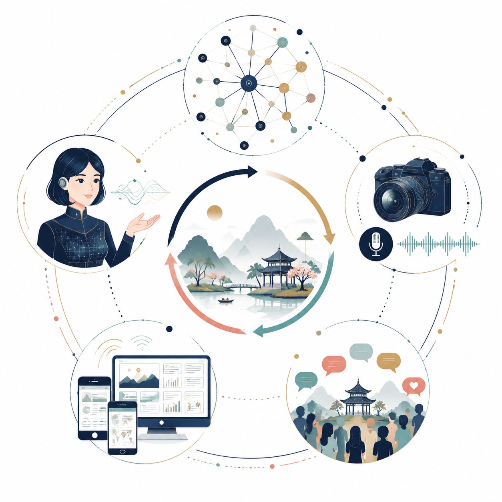
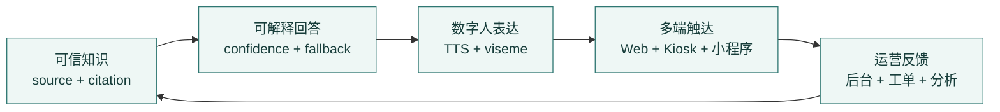
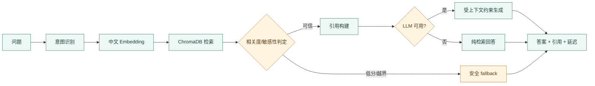
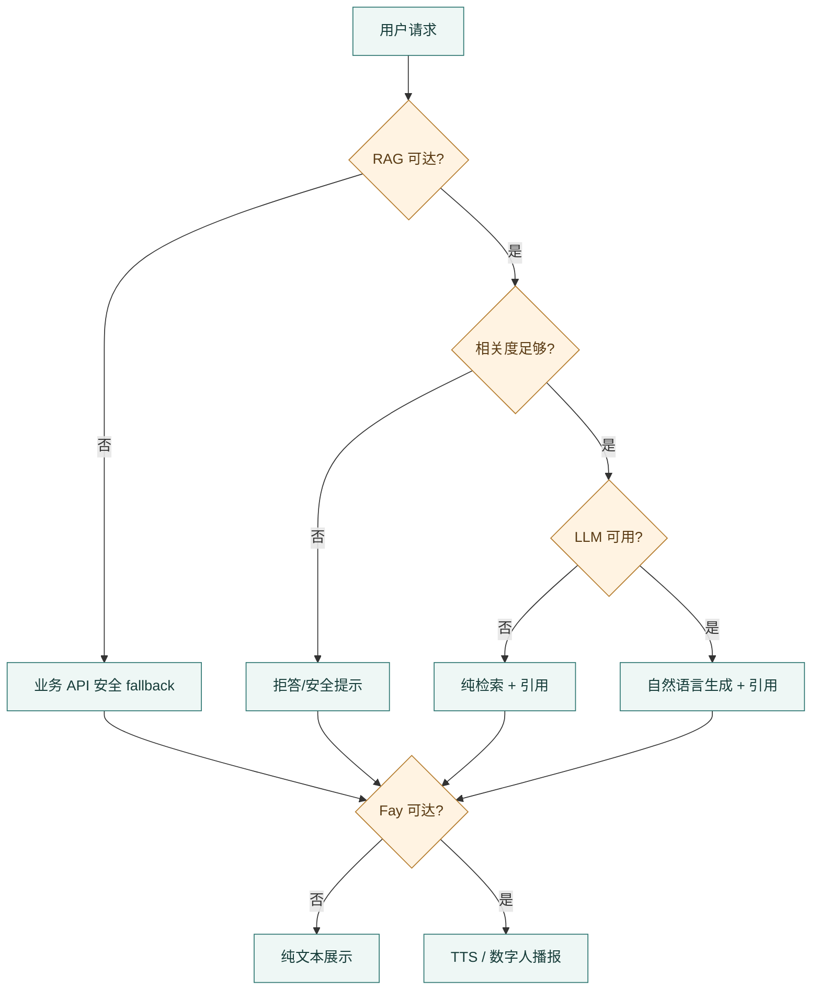

# 从“会回答”到“能证明”：灵山胜境智慧景区 AI 数字人导览平台创新总结

> **文档版本**：v1.1（证据化成果版）  
> **初版日期**：2026年6月30日  
> **实现复核日期**：2026年7月14日  
> **实现基线**：`main@c3ae3b6`（以当前工作区代码为准）  
> **文档定位**：用于答辩、PPT、演示视频与成果申报的项目亮点总结  
> **核心原则**：每项创新均给出“技术主张—实现证据—评审可见结果—当前边界”



*图 1　可信知识、多模态交互、多端触达与运营反馈共同构成创新闭环。*

> [!TIP]
> **一句话定位**：本项目不是把大模型简单接到景区导览上，而是围绕“信息可信、体验连贯、故障可降级、后台可运营”构建了一套可追溯、可演示、可持续迭代的景区 AI 数字人系统。

---

## 目录

1. [创新总览](#一创新总览)
2. [技术创新](#二技术创新)
3. [应用与体验创新](#三应用与体验创新)
4. [竞品差异与赛题价值](#四竞品差异与赛题价值)
5. [成果证据与实现边界](#五成果证据与实现边界)
6. [答辩表达建议](#六答辩表达建议)

---

## 一、创新总览

### 1.1 五项核心创新

| 核心创新 | 不是口号，而是 | 代码/资产证据 | 评审可见结果 |
|---|---|---|---|
| 可信 RAG | 回答、引用、置信度、fallback 同时返回 | `rag/rag_engine.py`、`rag/fallback.py`、`services/.../rag_proxy.py` | 高相关回答可追溯，低相关问题可安全拒答 |
| 数据可信链 | 数据携带 `source`、`freshnessLevel`、`citations` | business-api 数据模型与景点/RAG 路由 | 官方、人工与 mock 数据可区分 |
| 声学 LipSync | 50 ms 分帧、RMS 归一化、viseme 映射 | `test/ovr_lipsync/test_olipsync.py`、`core/fay_core.py` | 不依赖视频生成即可产出口型序列 |
| 多端运营闭环 | Web、Kiosk、小程序与 8 页后台共用服务层 | `frontend/src/App.tsx`、`miniprogram/app.json` | 游客服务与运营管理不是两个孤岛 |
| 可降级架构 | RAG、LLM、数字人运行时可分层退化 | 前端 API fallback、RAG fallback、Fay runtime 接口 | 局部服务异常时仍可保留可用体验 |

### 1.2 创新逻辑



*图 2　创新闭环：知识可信度驱动回答质量，交互数据再反哺运营与知识治理。*

---

## 二、技术创新

### 2.1 从“召回文本”到“可信回答”的 RAG 管线

传统 RAG 往往只完成“问题 → 向量检索 → 文本拼接”。本项目把 **可答性判断、引用构建、敏感信息过滤与 LLM 降级** 纳入同一条链路。



**差异化价值**：系统不仅告诉用户“答案是什么”，还保留“答案来自哪里、为什么可以回答、不能回答时如何退化”的证据链。

**当前边界**：准确率与拒答率必须基于固定 Golden Set 复测后给出，不使用未经复核的 90%/85% 等硬指标。

### 2.2 数据来源、新鲜度与引用的三重溯源

项目在业务数据与 RAG 响应中显式保留来源信息：

```json
{
  "source": "official | manual_seed | public_demo_package | mock",
  "freshnessLevel": "high | medium | low | static",
  "citations": [{ "source_name": "...", "excerpt": "..." }]
}
```

这使“官方资料、人工种子与模拟数据”能够在界面和接口层被区分，避免把演示数据包装成实时数据。对景区场景而言，这比单纯追求回答流畅度更重要，因为门票、开放时间、活动与应急信息都需要可追责。

### 2.3 音频振幅驱动的轻量口型同步


**技术价值**：使用信号处理直接从音频生成 viseme 序列，算法层面不依赖视频生成模型，适合在普通 CPU 环境中运行。

**当前边界**：Fay 侧已完成音频分析与 `Data.Lips` 写入；Web 主导览页目前仍以 Framer Motion 说话状态动画为主，尚未完成 Live2D 参数级闭环。

### 2.4 MCP 工具桥与数字人能力解耦

Fay 与外部知识/工具能力通过 MCP 服务层解耦，仓库中包含独立的 `faymcp` 管理服务、SSE 入口与景区数据、知识库等 MCP Server。

**价值**：知识库、窗口捕获、日程或景区数据能力可以作为工具独立演进，不必把所有逻辑写入数字人核心。

**工程提醒**：RAG 与 MCP 管理服务存在默认端口重叠风险，完整联调必须显式配置端口。

### 2.5 分层降级而不是单点失败



**评审价值**：可以主动演示正常、低置信度、模型不可用与数字人离线四种状态，而不是只展示一条“理想路径”。

---

## 三、应用与体验创新

### 3.1 三端矩阵，而不是单页 Demo

| 触达面 | 当前实现 | 主要价值 |
|---|---|---|
| Web 游客端 | `/guide`、`/kiosk` | 对话导览、景点与路线展示、现场大屏模式 |
| Web 管理端 | 8 个懒加载路由页面 | 知识、审核、工单、分析、指挥与运行监控 |
| 微信小程序 | 10 个页面 | 导览、景点、路线、拍照、票务、活动、服务、应急与反馈 |

三端共享业务服务和数据口径，使游客服务、现场展示和运营管理能够围绕同一景区知识与会话数据协同。

### 3.2 游客会话贯穿浏览、问答、到达与反馈

会话模型将消息、引用、到达事件、反馈和游客画像串联，为后续个性化推荐与运营分析提供数据基础。相比“每次提问都是孤立请求”，这种生命周期建模更贴近真实游览过程。

### 3.3 移动端优先与双语体验

- React 19 + TypeScript + Vite，管理路由采用 `React.lazy()` 与 `Suspense`。
- 纯手写 CSS，移动端优先，不依赖 Tailwind/MUI。
- Web 端具备中英文 i18n 机制；报告不把“界面翻译”自动等同于“所有后端回答均已完成双语质量验证”。

### 3.4 运营不是附属页，而是完整闭环

后台已从最初的数据大屏、知识库、审核、配置与设置扩展到指挥中心、数字人运行监控和工单中心。运营数据支持自动刷新，数字人监控支持状态轮询与播报控制，形成“发现问题—调整知识—控制播报—处理工单”的闭环。

---

## 四、竞品差异与赛题价值

### 4.1 能力对比

| 对比维度 | 固定语音导览 | 通用 AI 助手 | 本项目 |
|---|---|---|---|
| 景区知识 | 固定讲解词 | 通用知识，可能缺少景区上下文 | 官方资料入库 + 语义检索 |
| 可追溯性 | 内容固定但来源不显式 | 通常难以验证 | source / freshness / citations |
| 交互形态 | 单向播放 | 文本或语音对话 | Web/小程序/数字人运行时组合 |
| 低置信度处理 | 无问答 | 可能继续生成 | fallback、拒答、纯检索降级 |
| 运营能力 | 通常独立或缺失 | 不面向景区运营 | 知识、工单、指挥、运行监控 |
| 扩展方式 | 封闭设备 | 云 API 为主 | REST + WebSocket + MCP |

### 4.2 对 A5 赛题的直接价值

1. **数字人不是装饰层**：Fay 运行时、TTS、LipSync 与后台监控均有独立实现证据。
2. **大模型不是唯一智能来源**：本地 Embedding、向量检索、fallback 与引用共同控制回答风险。
3. **数据不是黑箱**：官方、种子与 mock 数据有来源标记。
4. **作品不是单端原型**：Web、Kiosk、小程序和后台形成完整展示矩阵。
5. **边界透明**：已实现、部分接通和规划能力明确分层，避免把目标方案写成既成事实。

---

## 五、成果证据与实现边界

### 5.1 可审计的实现数据

| 指标 | 当前可核事实 | 口径说明 |
|---|---:|---|
| Web 公开页面 | 2 | `/guide`、`/kiosk` |
| Web 管理页面 | 8 | App 路由中 8 个懒加载后台页面 |
| 微信小程序页面 | 10 | 以 `miniprogram/app.json` 注册页为准 |
| FastAPI 路由 | 123 | business-api 61 + admin-api 62 |
| RAG HTTP 路由 | 7 | 以 `rag/api.py` 当前装饰器为准 |
| 后端命名测试资产 | 66 | 不代表全部可执行或全绿 |
| 交付报告 | 4 | 需求、方案、测试、创新总结 |

> [!CAUTION]
> 不再使用“50,000+ 行代码、准确率 ≥ 90%、拒答率 ≥ 85%、端到端延迟 ≤ 5 秒”等缺少同一时间、同一环境、固定数据集复核的数字。此类指标应附测试脚本、样本集、硬件与原始结果后再进入答辩材料。

### 5.2 当前边界矩阵

| 能力 | 状态 | 说明 |
|---|:---:|---|
| business/admin API 主链路 | 已实现 | Web 与小程序默认对接 |
| RAG 核心检索/回答/重建 | 已实现 | 7 个路由 |
| RAG `/qa`、`/sources` HTTP 管理 | 部分接通 | JSON manager 已有，HTTP 路由需补齐 |
| Fay 侧 LipSync 生成 | 已实现 | 音频 RMS → viseme → Data.Lips |
| Web Live2D 参数级口型消费 | 待闭环 | 当前为状态动画 |
| 内容审核批准/驳回闭环 | 部分实现 | 页面以展示和状态映射为主 |
| 数字人配置保存并运行时生效 | 部分实现 | 当前完成列表、选择与预览 |
| CI 测试门禁 | 待完善 | Actions 主要用于 Pages 构建部署 |

---

## 六、答辩表达建议

### 6.1 30 秒版本

> 我们没有把大模型简单接进景区页面，而是做了一条可验证的服务链：官方资料进入 RAG 后，每次回答同时保留引用、置信度和降级信息；回答再进入 Fay 运行时生成语音与口型序列；游客通过 Web、Kiosk 和小程序使用，运营人员通过 8 个后台页面维护知识、处理工单并监控数字人。系统的核心优势不是“会聊天”，而是“能讲清、能追溯、能降级、能运营”。

### 6.2 演示顺序

1. 正常问答：展示答案、来源和置信度。
2. 低相关问题：展示 fallback/拒答。
3. 路线与景点：展示官方数据与多端一致性。
4. 数字人播报：展示 Fay 侧 TTS 与 LipSync 数据链。
5. 后台运营：展示指挥中心、知识管理、工单与运行监控。
6. 主动说明边界：Web Live2D 参数消费、RAG 元数据管理路由和 CI 门禁仍在完善。

---

> **文档编制说明**  
> 本文只采用可从当前仓库核验的事实。所有“创新”均同时标注实现证据和当前边界，便于评审快速区分已经落地的成果、部分接通的链路与后续演进目标。
