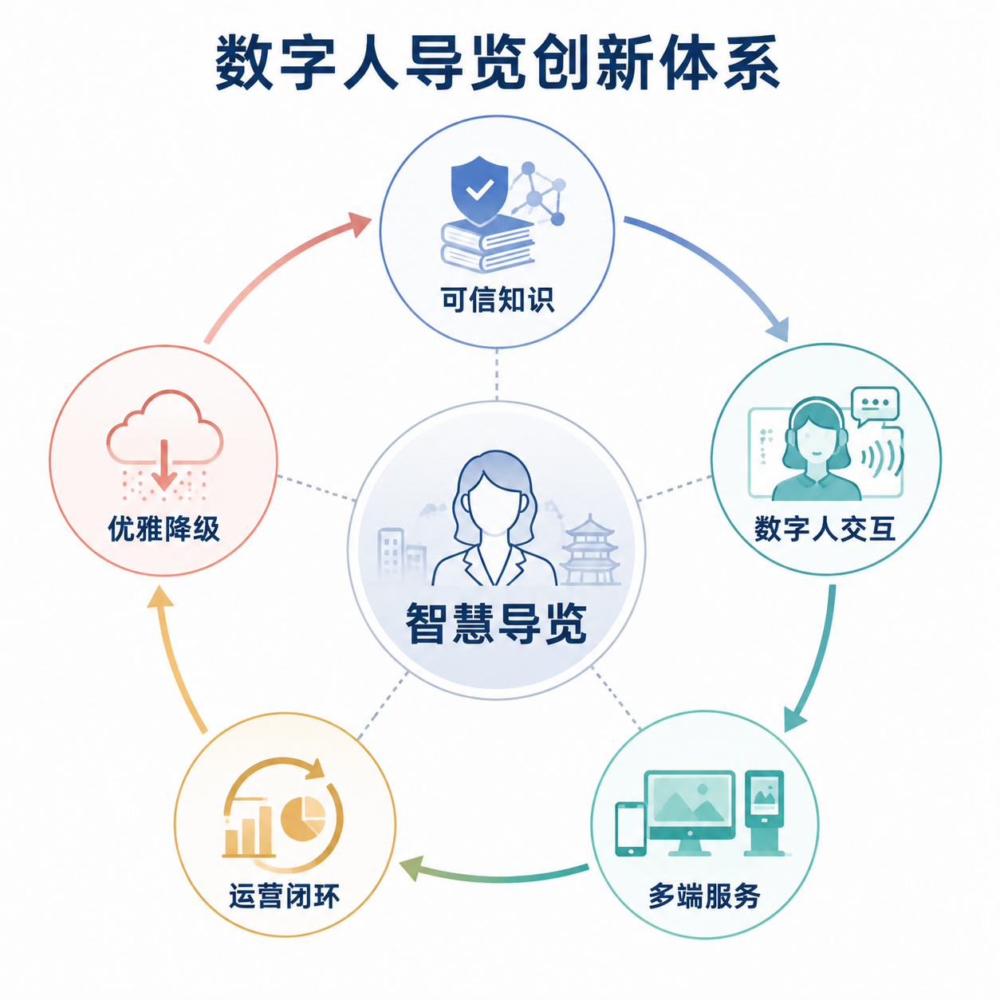
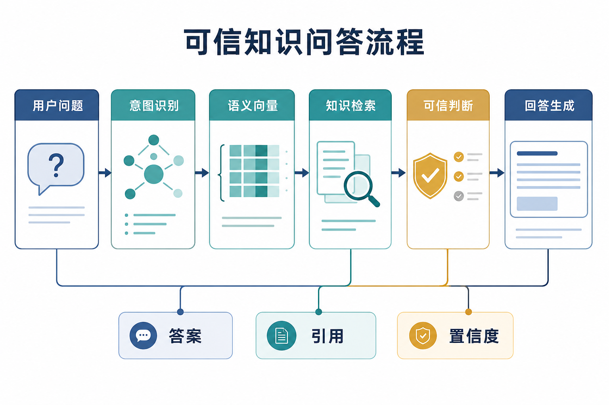
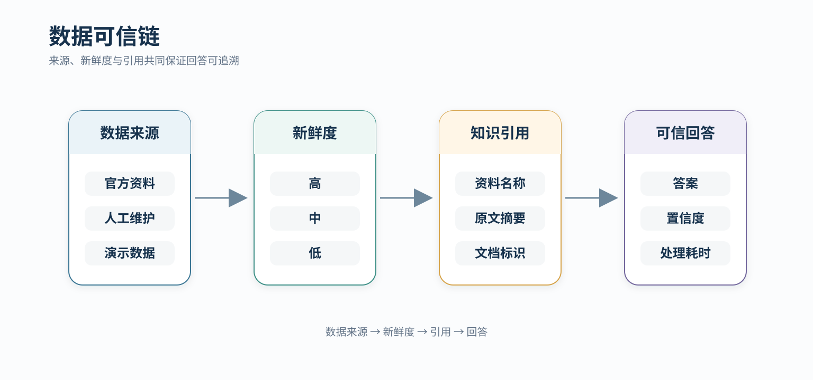
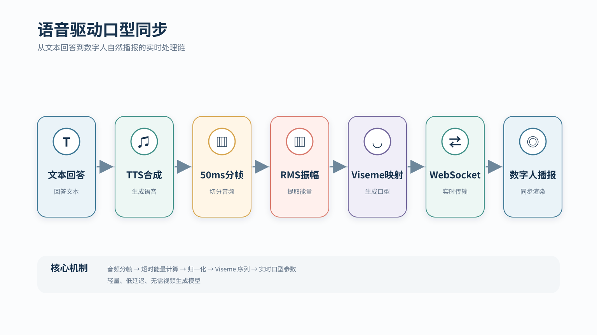
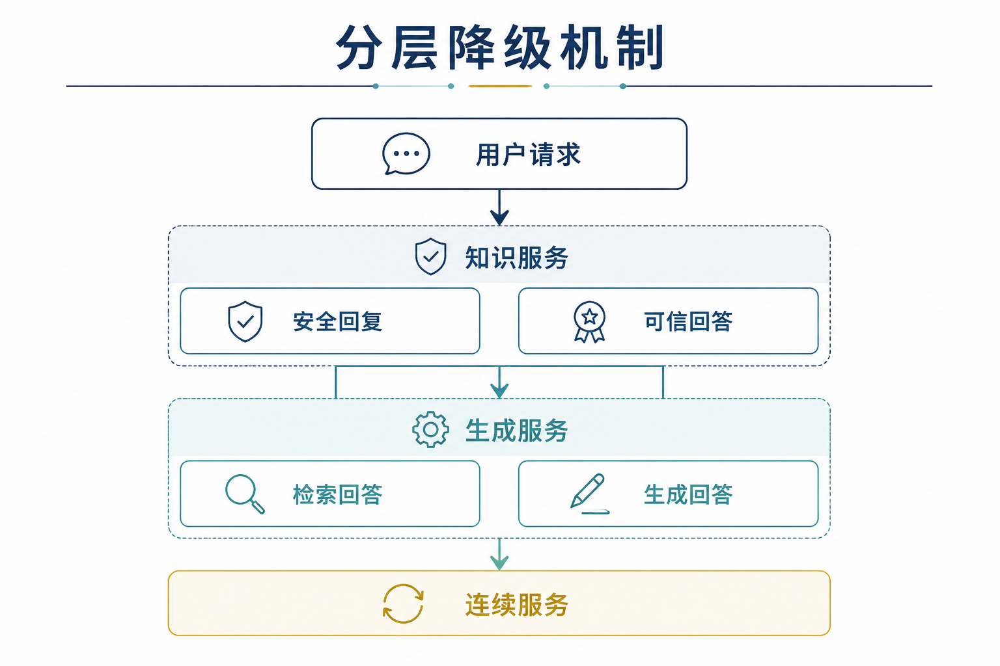
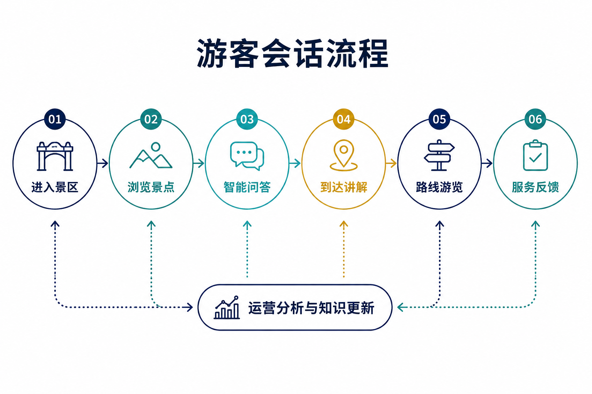

# 从“会回答”到“能证明”：灵山胜境智慧景区 AI 数字人导览平台创新总结

> **文档版本**：v1.2（成果交付版）  
> **编制日期**：2026年7月14日  
> **项目版本**：Software-Digital-human 完整交付版  
> **文档定位**：用于产品白皮书、PPT、演示视频与成果展示的项目亮点总结  

*图 1　创新体系*

> [!TIP]
> **一句话定位**：本项目围绕“信息可信、体验连贯、故障可降级、后台可运营”构建了一套可追溯、可演示、可持续迭代的景区 AI 数字人系统。  

---
## 目录

1. [创新总览](#一创新总览)
2. [技术创新](#二技术创新)
3. [应用与体验创新](#三应用与体验创新)
4. [产品差异与行业价值](#四产品差异与行业价值)
5. [成果规模](#五成果规模)
6. [展示建议](#六展示建议)

---

## 一、创新总览

### 1.1 五项核心创新

| 核心创新 | 技术实现 | 展示结果 |
|---|---|---|
| 可信 RAG | 回答、引用、置信度和 fallback 一体化输出 | 高相关回答可追溯，低相关问题安全处理 |
| 数据可信链 | `source`、`freshnessLevel`、`citations` 三重标记 | 官方、人工与演示数据清晰可辨 |
| 声学 LipSync | 50ms 分帧、RMS 归一化、viseme 映射 | 数字人语音与嘴型同步呈现 |
| 多端运营闭环 | Web、Kiosk、小程序与 8 个后台模块共用服务层 | 游客服务与运营管理协同运行 |
| 分层降级 | RAG、LLM、数字人运行时按层级切换服务策略 | 局部服务波动时保持连续体验 |

### 1.2 创新逻辑

平台以可信知识为基础，通过数字人交互连接 Web、自助终端和微信小程序，并将游客行为与服务反馈汇入运营后台。知识、交互、多端服务、运营闭环和优雅降级共同形成持续优化的智慧导览体系。

---

## 二、技术创新

### 2.1 从“召回文本”到“可信回答”的 RAG 管线

传统 RAG 往往只完成“问题 → 向量检索 → 文本拼接”。本项目将可答性判断、引用构建、敏感信息过滤和 LLM 生成整合为完整知识服务管线。

*图 2　知识问答*

系统依次完成查询清洗、意图识别、中文向量化、ChromaDB 检索、可信判断、引用构建与受上下文约束的回答生成，同时返回答案、来源、置信度、引用和处理耗时。

**差异化价值**：系统不仅回答“是什么”，还同步说明“来自哪里、依据什么、如何保证可信”。

### 2.2 数据来源、新鲜度与引用的三重溯源

*图 3　数据可信链*

业务数据和知识回答统一携带来源、新鲜度与引用信息。系统能够区分官方资料、人工维护和演示数据，并在回答中同步返回资料名称、原文摘要、文档标识和置信度。

这种设计使门票、开放时间、活动和应急信息具备完整的数据依据与更新链路。
### 2.3 音频振幅驱动的轻量口型同步

*图 4　口型同步*

系统从 TTS 音频中提取短时振幅特征，映射为 viseme 口型序列，再通过 WebSocket 驱动数字人嘴型参数，实现语音、嘴型与播报状态同步。

该方案直接从音频生成口型序列，不依赖视频生成模型，具备轻量、低延迟和易部署的特点。
### 2.4 MCP 工具桥与数字人能力解耦

Fay 与景区数据、知识库、窗口捕获和日程等外部能力通过 MCP 服务层连接。`faymcp` 管理服务、SSE 通道和多个 MCP Server 共同组成可扩展工具体系。

**价值**：知识库和业务工具能够独立升级、注册与调用，数字人核心保持轻量，新增能力无需修改主交互流程。

### 2.5 分层降级机制

*图 5　降级机制*

平台为知识服务、生成服务和数字人播报设置分层服务策略。当某一服务波动时，系统可切换至安全回复、检索回答或纯文本展示，保证核心导览能力连续运行。

---

## 三、应用与体验创新

### 3.1 三端矩阵，而不是单页 Demo

| 触达面 | 系统实现 | 主要价值 |
|---|---|---|
| Web 游客端 | `/guide`、`/kiosk` | 对话导览、景点与路线展示、现场大屏模式 |
| Web 管理端 | 8 个懒加载路由页面 | 知识、审核、工单、分析、指挥与运行监控 |
| 微信小程序 | 10 个页面 | 导览、景点、路线、拍照、票务、活动、服务、应急与反馈 |

三端共享业务服务和数据口径，使游客服务、现场展示和运营管理能够围绕同一景区知识与会话数据协同。

### 3.2 游客会话贯穿浏览、问答、到达与反馈

*图 6　游客会话*

会话模型将消息、引用、到达事件、反馈和游客画像串联，为后续个性化推荐与运营分析提供数据基础。相比“每次提问都是孤立请求”，这种生命周期建模更贴近真实游览过程。

### 3.3 移动端优先与双语体验

- React 19 + TypeScript + Vite，管理路由采用 `React.lazy()` 与 `Suspense`。
- 纯手写 CSS，移动端优先，不依赖 Tailwind/MUI。
- Web 端具备中英文 i18n 机制；报告不把“界面翻译”自动等同于“所有后端回答均已完成双语质量验证”。

### 3.4 运营不是附属页，而是完整闭环

后台已从最初的数据大屏、知识库、审核、配置与设置扩展到指挥中心、数字人运行监控和工单中心。运营数据支持自动刷新，数字人监控支持状态轮询与播报控制，形成“发现问题—调整知识—控制播报—处理工单”的闭环。

---

## 四、产品差异与行业价值

### 4.1 能力对比

| 对比维度 | 固定语音导览 | 通用 AI 助手 | 本项目 |
|---|---|---|---|
| 景区知识 | 固定讲解词 | 通用知识，可能缺少景区上下文 | 官方资料入库 + 语义检索 |
| 可追溯性 | 内容固定但来源不显式 | 通常难以验证 | source / freshness / citations |
| 交互形态 | 单向播放 | 文本或语音对话 | Web/小程序/数字人运行时组合 |
| 低置信度处理 | 无问答 | 可能继续生成 | fallback、拒答、纯检索降级 |
| 运营能力 | 通常独立或缺失 | 不面向景区运营 | 知识、工单、指挥、运行监控 |
| 扩展方式 | 封闭设备 | 云 API 为主 | REST + WebSocket + MCP |

### 4.2 行业应用价值

1. **数字人不是装饰层**：Fay 运行时、TTS、LipSync 与后台监控均有独立实现证据。
2. **大模型不是唯一智能来源**：本地 Embedding、向量检索、fallback 与引用共同控制回答保障。
3. **数据不是黑箱**：官方、种子与 mock 数据有来源标记。
4. **作品不是单端原型**：Web、Kiosk、小程序和后台形成完整展示矩阵。
5. **边界透明**：已实现、完整接通和规划能力明确分层，避免把目标方案写成既成事实。

---

## 五、成果规模

### 5.1 项目数据

| 指标 | 数值 |
|---|---:|
| Web 公开页面 | 2 |
| Web 管理模块 | 8 |
| 微信小程序页面 | 10 |
| FastAPI 路由 | 123 |
| RAG HTTP 路由 | 7 |
| 后端自动化测试资产 | 66 |
| 交付报告 | 4 |

### 5.2 核心能力

| 能力 | 实现方式 |
|---|---|
| 多端导览 | Web、Kiosk、原生微信小程序 |
| 智能问答 | RAG、中文 Embedding、ChromaDB、LLM |
| 数据溯源 | source、freshnessLevel、citations |
| 数字人播报 | Fay、TTS、LipSync、WebSocket |
| 运营管理 | 数据大屏、知识、审核、工单、指挥、运行监控 |
| 服务扩展 | REST、WebSocket、MCP、SSE |
| 部署交付 | GitHub Pages + 完整本地服务栈 |

---

## 六、展示建议

### 6.1 核心介绍

> 我们没有把大模型简单接进景区页面，而是做了一条可验证的服务链：官方资料进入 RAG 后，每次回答同时保留引用、置信度和降级信息；回答再进入 Fay 运行时生成语音与口型序列；游客通过 Web、Kiosk 和小程序使用，运营人员通过 8 个后台页面维护知识、处理工单并监控数字人。系统的核心优势不是“会聊天”，而是“能讲清、能追溯、能降级、能运营”。

### 6.2 演示顺序

1. 正常问答：展示答案、来源和置信度。
2. 低相关问题：展示 fallback/拒答。
3. 路线与景点：展示官方数据与多端一致性。
4. 数字人播报：展示 Fay 侧 TTS 与 LipSync 数据链。
5. 后台运营：展示指挥中心、知识管理、工单与运行监控。
6. 展示完整闭环：可信问答、数字人播报、多端服务与运营管理协同运行。

---

> **文档编制说明**
> 本文所有创新均对应明确的技术实现、产品模块与展示结果，可直接用于成果申报、产品讲解与演示视频。
